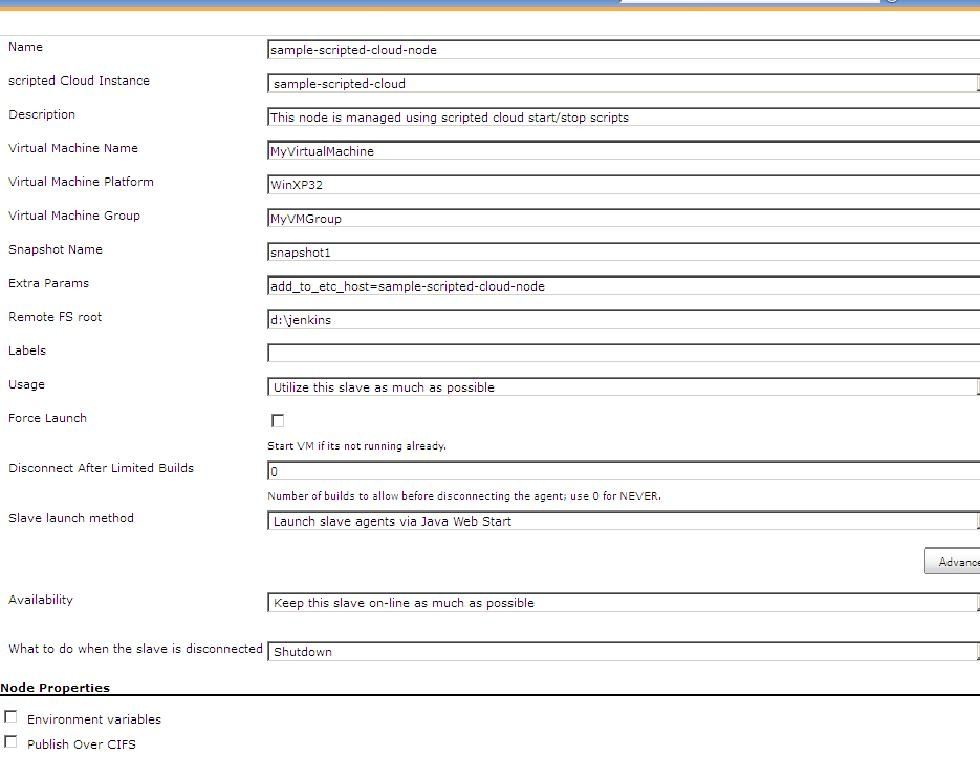

  

Add script based slave VM management to Jenkins to use virtual machines
as slaves

### **Description**

This plugin adds to the Jenkins CI a way to control virtual machines
through scripts. It takes two scripts: one for starting

**NOTE:** A great deal of thanks to the authors of the [vshpere cloud
Plugin](https://wiki.jenkins-ci.org/display/JENKINS/vSphere+Cloud+Plugin);
their  
code was heavily copied to make this plugin.

### Configuration

##### scripted Cloud Configuration

The first step is to add a new "Cloud" in the Jenkins "Configure System"
menu based on "scripted Cloud". Enter its description, start and stop
scripts.

Start script: This is called while launching slave of this cloud. Its
expected that this script ensures that VM is up and running. Configure
the slave configuration on VM such that it connects to master
automatically on start. For this setup slave by options: Java web start
or add a startup script on slave to connect to master.

Stop script: This is called after the job has finished after all
post-build steps.

You can pass parameters to these scripts in the text box, e.g.
my\_startup\_script param1 param2 ...

Various environment variables are passed to these scripts as mentioned
next section.

##### scripted Slave Configuration

Select "**Slave virtual computer running under scripted Cloud"** while
creating node. Following screen shot shows node configuration.

  
Here is description of important inputs. The test enclosed brackets
after input name is the environment variable exposed to selected
scripted-cloud start/stop scripts.

-   scripted Cloud Instance: This is the name of the scripted Cloud that
    you want to use
-   Virtual Machine Name     (**SCVM\_NAME**)               : The name
    of the virtual machine as it appears in scripted.
-   Virtual Machine Platform (**SCVM\_PLATFORM**)       : The name of
    the virtual machine as it appears in scripted.
-   Virtual Machine Group    (**SCVM\_GROUP**)             : The name of
    the virtual machine as it appears in scripted.
-   Snapshot Name             (**SCVM\_SNAPNAME**)      : the name of
    the snapshot to use. This is optional.
-   Force VM Launch           (**SCVM\_FORCESTART**)  : Launches the
    virtual machine when necessary.
-   Extra Params                (**SCVM\_EXTRAPARAMS)**: Extra inputs to
    start/stop scripts. E.g. in above snapshot I have passed
    "add\_to\_etc\_host=sample-scripted-cloud-node". I using this in my
    start script to IP of newly started VM to /etc/hosts on master to
    refer it by name in other steps.
-   Disconnect after Limited Builds: Will force the slave agent to
    disconnect after the specified number of builds have been
    performed,  
    triggering the disconnect action.
-   What to do when the slave is disconnected: Action to perform
    (Shutdown, Revert, Reset, Nothing) when the slave is disconnected,
    either  
    manually or via Jenkins.
-   Following are environment variables set in addition to above inputs:
    -   **SCVM\_ACTION** : "start" while calling start script and "stop"
        while calling stop script
    -   **SCVM\_STOPACTION** : This corresponds to the value of
        "Availability". Values are: "shutdown", "restart", "reset"

You can just check what all environment variables are available to
start/stop script by adding "set" or "env" command in start/stop
scripts. Environment variables set by this plugin starts with "SCVM".

Scripted cloud scripts mentioned by user can use these variables in any
way. Plugin just assumes that VM slave is ready and connected when start
script ends.

### Developer Notes

I have following basic scenarios successfully:

-   choosing ssh mechanism in slave launch method and shutdown as action
    in end
-   choosing java web start in slave launch method and shutdown as
    action in end

Planning to remove following configuration :

-   "Disconnect after Limited Builds" : This does not matter to user
    much so I will remove it to avoid confusion.

### Change Log

##### Version 0.1 (May 25, 2102)
