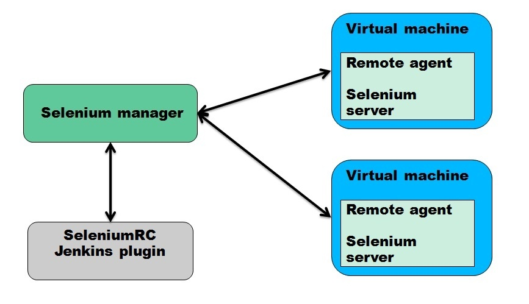
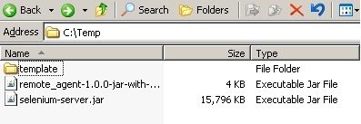
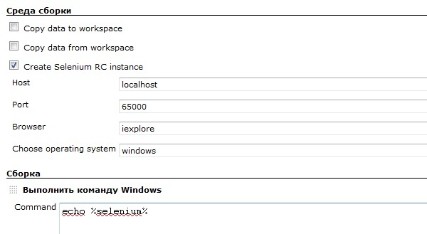

  

This plugin allows you to create Selenium server instance for each
project build.

Hudson 1.366 or later.

This plugin was created for Hudson 1.366. It might not work with earlier
versions of Hudson.

# User guide

We want to run several Selenium tests during build. Our tests have
dependencies between themselves. That's why we can't run them in
parallel. So we need unique Selenium server for each build. We have the
following idea

1\. First, you need to configure [Selenium
manager](https://sourceforge.net/projects/atcc/files/). Download and
extract the archive. There is configuration file settings.xml. You need
to add information about your virtual machines there. Manager can work
with Windows and Linux machines.

Manager connects to Windows machine using RDP. So if you are using
virtual machines with Windows you need to set up Selenium manager on
Windows machine. Selenium manager uses RdpConfigs\\template.rdp for
creating RDP session. You should add credentials to this file using
"mstsc" program. After that you may run Selenium manager by using "java
-jar selenium\_manager-1.0.0-jar-with-dependencies" command.

Manager connects to Linux machine using SSH (j2ssh-core ver. 0.2.9).
Selenium server needs X session (DISPLAY variable). So, you need to
install Xvfb on Linux machines.

2\. Than you need to configure [Remote
agent](https://sourceforge.net/projects/atcc/files/). For Windows you
should use the directory specified in settings.xml. For Linux you should
use user's home folder. In this directory place
remote\_agent-1.0.0-jar-with-dependencies.jar, selenium-server.jar.
Create folder "template" for Firefox profile template. If you don't have
any template leave this directory empty. Example

3\. After that you need to configure your project. Select "Create
Selenium RC instance" in project build environment. "Host" and "Port"
fields indicate Selenium manager instance. "Choose operating system"
field indicates the type of operating system. Only Windows and Linux are
available. "Browser" field indicates the type of browser which you need
for your tests. For example, iexploreor or firefox. You may add other
browsers to your settings.xml file. After that you may use them in
SeleniumRC plugin. In your build scripts you should use variable called
"selenium". Example

4\. Run your build. Plugin will send browser and OS to Selenium manager.
Manager will find node with these browser and OS. After that manager
will connect to specified node.

For Windows nodes: manager will open RDP session to selected node. In
this session manager will start Remote agent. Agent will start Selenium
server using this command:

"java -jar selenium-server.jar -browserSideLog -log selenium.log
-multiwindow -port args\[1\] -firefoxProfileTemplate args\[2\]", where
args\[2\] = "template" by default.

For Linux nodes: manager will open SSH session to selected node. In this
session manager will start Remote agent. Agent will start Xvfb and
export DISPLAY variable. After that agent will start Selenium server
using this command:

"java -jar selenium-server.jar -browserSideLog -log selenium.log
-multiwindow -port args\[1\] -firefoxProfileTemplate args\[2\]", where
args\[2\] = "template" by default.

5\. As the result you will get a Selenium server instance url or message
"Connection failed". Example

or

## Changelog 

##### Version 1.0 (March 1, 2011) 

-   Initial release.
