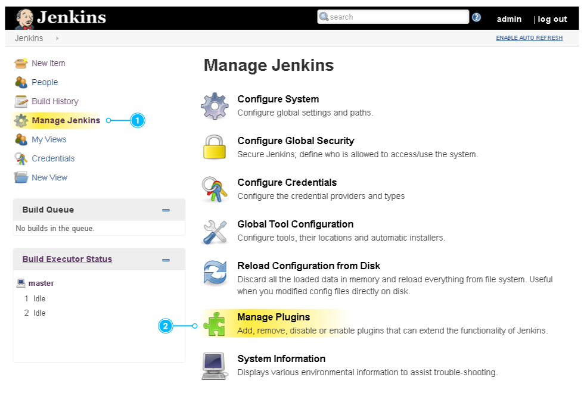
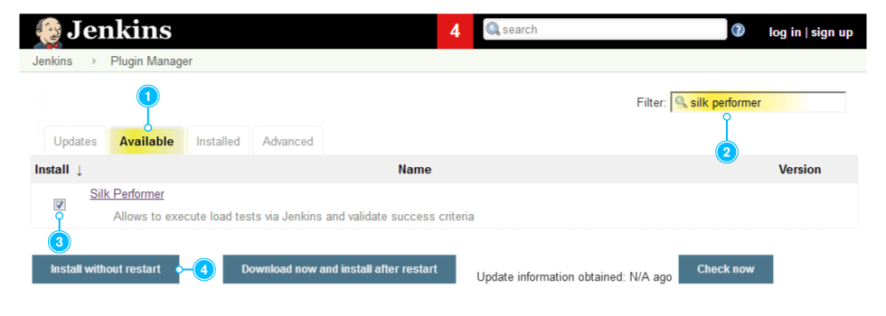
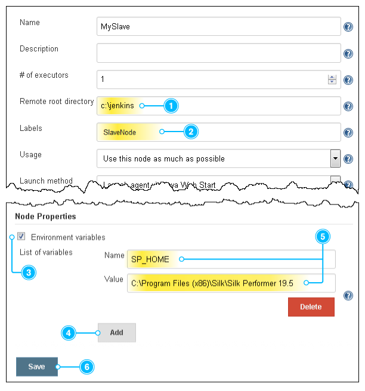
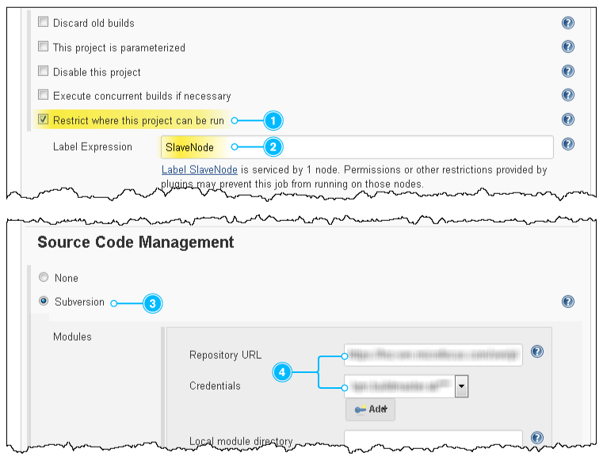
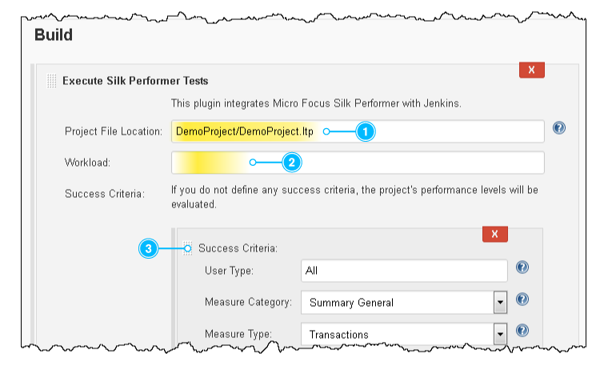
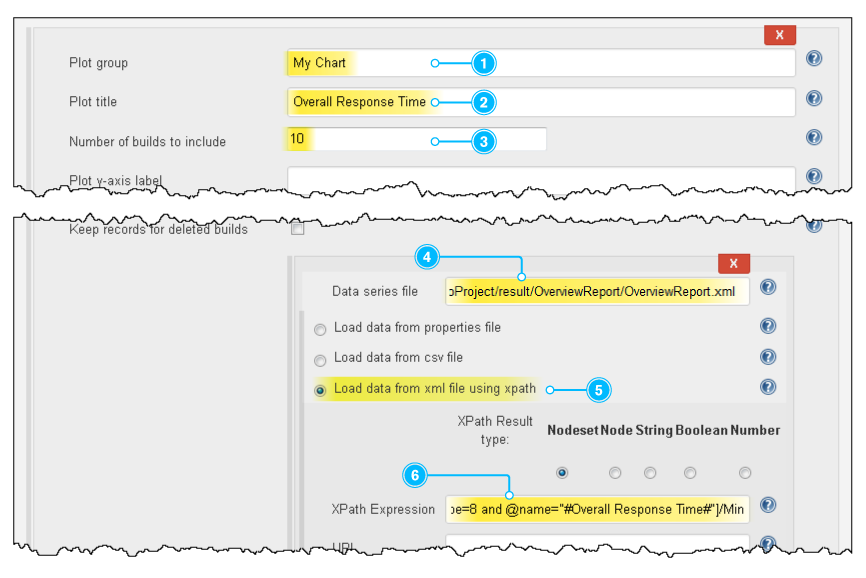
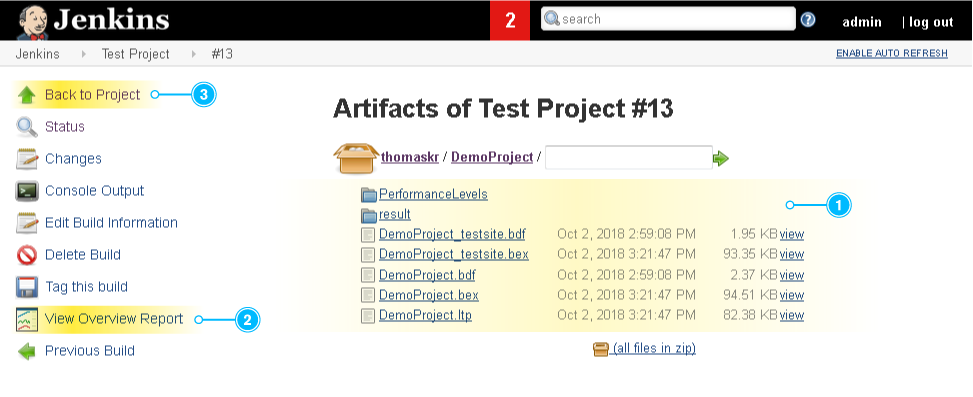
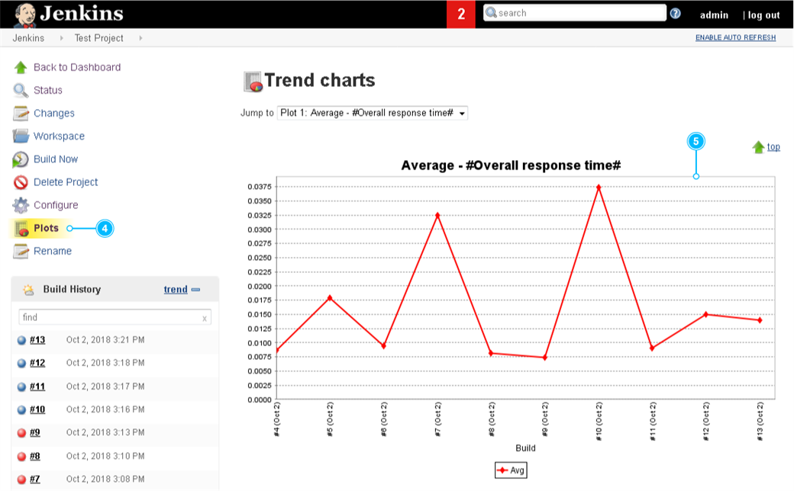
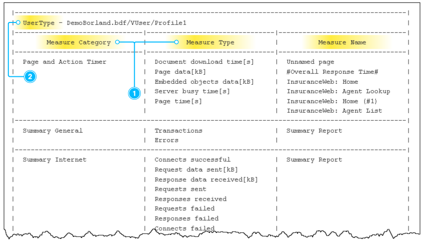

Allows users to execute a Silk Performer load test: [Silk
Performer](https://www.microfocus.com/products/silk-portfolio/silk-performer/)  
  

The Silk Performer plugin for Jenkins has received a major upgrade and
now provides a number of new features. It lets you automate Silk
Performer projects, collect results, and evaluate success conditions.
This article guides you through setting up the plugin. To learn more
about the new features and enhancements of the plugin, read the blog
post [Released: Silk Performer
19.5](https://community.microfocus.com/borland/test/silk_performer_-_application_performance_testing/b/weblog/posts/released-silk-performer-19-5 "Released: Silk Performer 19.5").

Setting up the plugin involves the following steps:

1.  Installing the plugin
2.  Adding a Jenkins agent
3.  Creating a job
4.  Adding build steps
5.  Adding post-build actions
6.  Executing the job

  

### 1. Installing the plugin

First, open Jenkins in a browser. Click **Manage Jenkins** in the menu
on the top left ① and click **Manage Plugins** ②.

{width="700"}

  

Click the **Available** tab ① and enter *Silk Performer* in the filter
on the top right ②. Now we can click the check box ③ and **Install
without restart** ④.

{width="700"}

  

### 2. Adding an agent

The Silk Performer plugin is installed. To run a Silk Performer project
in Jenkins you need a Jenkins agent node running on Windows in a 32-bit
JRE. In addition, Silk Performer must be installed on the agent node. If
you don't have such an agent yet, create a new one:

-   Click **Manage Jenkins**, **Manage Nodes**, and **New Node**.
-   Enter a name, select **Permanent Agent**, and click **OK**.
-   Configure the agent as follows: Specify a **Remote root directory**
    ① and a label ②.  
    In our example, we add the label *SlaveNode*.
-   Check **Environment variables** ③ and click **Add** ④. Name the
    variable *SP\_HOME* and  
    specify the installation directory of Silk Performer as value ⑤. In
    most cases, the installation directory will resemble the
    following:  
    *C:\\Program Files (x86)\\Silk\\Silk Performer 19.5*
-   Click **Save** ⑥.

  

### 3. Creating a job

Once the agent is online, you can create a new job using this agent.

-   Click **New Item**, enter a name, click **Freestyle Project**, and
    click **OK**.
-   Restrict the project to the agent you have just created: Check
    **Restrict where this project** **can be run** ① and specify the
    **Label Expression** ②.  
    In our example, this is the label *SlaveNode*, as defined above.
-   Configure your **Source Code Management** system that holds your
    Silk Performer projects. In our example, we use **Subversion** ③
    including the respective URL and credentials ④.

{width="700"}

  

### 4. Adding build steps

-   In the **Build** section, click **Add build step** and **Execute
    Silk Performer tests**.
-   Specify the **Project File Location** ①. This is a relative path to
    your workspace.
-   Specify a **Workload** ②. If you omit this field, the project’s
    default workload will be used.
-   You can add custom **Success Criteria** ③ directly in the build step
    or rely on the performance levels defined within the Silk Performer
    project.

{width="700"}

  

### 5. Adding post-build actions

-   Click **Add post-build action** and **Archive the artifacts**. Then
    specify the **Files to archive**.  
    In our example, we defined *DemoProject/\*\*/\**.  
    Make sure to use the wildcards as shown here to get hold of all
    files in all folders, including all subfolders.
-   To get a trend chart, click **Add post-build action** and **Plot
    build data**.
-   Specify a **Plot group** ①, a **Plot title** ②, and the **Number of
    builds to include** ③.
-   Specify a **Data series file** ④. In our example, we use the
    *OverviewReport.xml*, which is collected by the action **Archive the
    artifacts**.
-   Select **Load data from xml file using xpath** ⑤ and specify an
    **XPath Expression** ⑥ to read any value of the .xml file. In our
    example, we use the following expression:

  

`Overview_Report_Data/UserGroups/Group[Name="DemoProject_testsite.bdf/VUser-Profile1"]/Measures/``Measure[Class="Transaction" and Name="#Overall Response Time#" and Type ="Trans.(busy) ok[s]"]/``Avg`

{width="700"}

-   To include additional values in the chart, for example the maximum,
    click **Add**.  
    In our example, we define the maximum value using the following
    expression:

`Overview_Report_Data/UserGroups/Group[Name="DemoProject_testsite.bdf/VUser-Profile1"]/Measures/``Measure[Class="Transaction" and Name="#Overall Response Time#" and Type ="Trans.(busy) ok[s]"]/``MaxMax`

-   Click **Save**. The job is now configured.

  

### 6. Executing the job

Everything is set up now. Execute the job on the agent to receive load
test results.

-   Tip: The console provides valuable information while the job is
    being executed.
-   Once the job is completed, click **Last Successful Artifacts** to
    view the artifacts of the load test ①.
-   Click **View Overview Report** ② to open the report directly within
    Jenkins.
-   Click **Back to Project** ③ and **Plots** ④ to view the chart ⑤ you
    have configured above.

{width="700"}

{width="700"}

  

  

Note: If you do not use *English* as your Jenkins locale, the chart
might not display any data. To fix this problem, install the *Locale
plugin*. Then click **Manage Jenkins \> Configure System**, and set the
**Default Language** to *English*.

After the first execution it can be helpful to take a look at the
console output. It shows a table with the columns **Measure Category**,
**Measure Type**, and **Measure Name** ① for each user type ②. You can
use these tables to define success criteria for upcoming executions.
Review the screenshot in step 4: it shows the very same parameters (user
type, measure category, etc.).

{width="700"}

  
