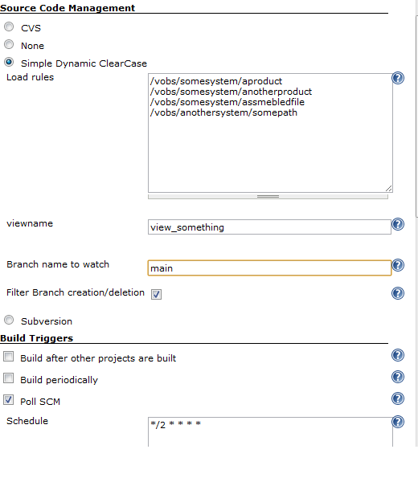

Integrates Jenkins with
[ClearCase](http://www.ibm.com/software/awdtools/clearcase/).  
This plugin interfaces Jenkins against a dynamic base view, Clearcase
SCM. Its 'Simple' in the sense of feature availability. In contrast with
[ClearCase
Plugin](http://localhost:8085/display/JENKINS/ClearCase+Plugin) you
don't define a static config specification in the SCM plugin. Rather
what you specify is a view name and the load rules which are to be
tracked inside of ClearCase repository.

As the view is dynamic, the plugin doesn't take any snapshots of the
source code, the checkout mechanism will only review the clear tool
lshistory over the specified 'load rules'. The load rules are in simple
terms only paths inside of the view to specific code bases.

Since you usually specifiy a branch in ClearCase, the option has been
added. Which means that SCM-plugin only tracks changes in that branch.
If you don't set an value for Branch, it will notify changes as soon as
there is a change in any branch - which isn't what most people are
looking for.

There is also a optional setting which is filter, it disregards mkbranch
and rmbranch events occuring in ClearCase, since branch creation doesn't
affect a specific branch it reduces the "false positive" in build.

  
Here you can see that the schedule is Poll SCM each other minute
(setting can be any value of course, this is just an example), which
means that the plugin will check over the defined load rules if there
has been any changes. If so, and the quiet time of plugin (there is
internal quiet time, check repository code for constant) is passed then
an scm changes is reported to Jenkins.

The view itself can be configured by ClearTool or a more advanced setup
if you require it. For instance if there are a couple of daily releases
from other departments within your corporation which you want to track
inside of the view.

If that is required, you can create a Jenkins job which has the task of
updating the config spec, in for instance a shell script. That job
should be marked as [Exclusive
Execution](http://localhost:8085/display/JENKINS/Exclusive+Execution+Plugin)
by installing the referred plugin. This will ensure no inconsistencies
will happen as the updating of config spec is being performed in
solitude, no other jobs are being executed.

## Change Log

#### Version 1.2

-   Added optional filter function for rmbranch, mkbranch
-   Added capability to watch specific ClearCase Branch, instead of all
-   Removed limitation of white space in file paths
-   Added abort exception when checkout failes due to:
    -   incorrect branch
    -   ClearCase error
-   Improved error handling in compareRevision and Checkout

#### Version 1.0

-   Initial release
