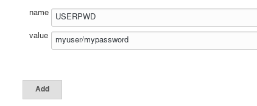
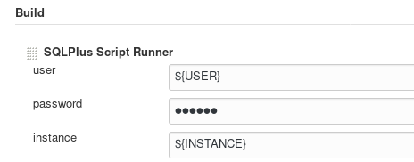
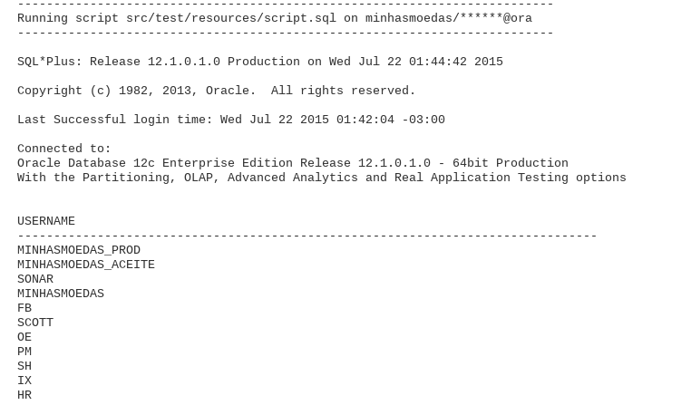

| Plugin Information                                                                                                      |
|-------------------------------------------------------------------------------------------------------------------------|
| View SQLPlus Script Runner [on the plugin site](https://plugins.jenkins.io/sqlplus-script-runner) for more information. |

Older versions of this plugin may not be safe to use. Please review the
following warnings before using an older version:

-   [Password written to the build
    log](https://www.jenkins.io/security/advisory/2020-11-04/#SECURITY-2129)

This plugin enables you run [Oracle
SQL\*Plus](http://www.orafaq.com/wiki/SQL*Plus_FAQ) scripts on your
Jenkins jobs (user defined scripts or a script inside a workspace).

# Releases

-   **1.x** - For Jenkins 1.x

&nbsp;

-   **2.x** - For mainly Jenkins 2.x, credentials plugins implemented
    and pipeline support

  

Migration Guide

To migrate your workspace from version 2 is very simple, all you need to
do is:

1.  Create a credential for your user and password;
2.  Edit you job configuration and select one credential;
3.  Save your changes and you are good to go!

  

  

# Summary

This plugin enables you run Oracle SQL\*Plus scripts on your Jenkins
jobs ( *Oracle SQL\*Plus installation required!* ).

# Configuration

## Global

All you have to do is check the auto detect ORACLE\_HOME option ( or a
valid *ORACLE\_HOME* ) and you are in business:


  

  

If you are having problems try to enable *Debug info* to see what is
going on.

## By Job

You can run a script inside your workspace or a user defined for every
job:

  

Version 1.x:

  

 


  

Version 2.x :

  


# Environment variables

  

Pay attention to what version you are using in order to work with
variables:

  

| variable | Version 1.x |        Version 2.x        |
|----------|:-----------:|:-------------------------:|
| user     |       ok    | *replaced by credentials* |
| password |      ok     | *replaced by credentials* |
| instance |      ok     |             ok            |

  

  

You can use global variables for **user** and **instance**, first
creating it in *Jenkins*→ *configuration* :


  

You *user* global variable can hold **username and password** as well
like this (*username/password*):

  



  

And then using it:



# Running

You can check later all SQL\*Plus output inside your build output:



  

# Pipeline

  

## User defined script

  

``` syntaxhighlighter-pre
node {
   echo 'SQLPlusRunner running user define script for system@xe'
  
 step([$class: 'SQLPlusRunnerBuilder',credentialsId:'system', 
instance:'xe',scriptType:'userDefined', script: '',scriptContent: 
'select * from v$version'])
}
```

  

  

## File script

  

``` syntaxhighlighter-pre
node {
   echo 'SQLPlusRunner running file script for system@xe'
  
 step([$class: 'SQLPlusRunnerBuilder',credentialsId:'system', 
instance:'xe',scriptType:'file', script: 'start.sql',scriptContent: ''])
}
```

  

  

## Optional pipeline parameters

  

-   customOracleHome
-   customSQLPlusHome
-   customTNSAdmin

  

  

Download the last release and give it a try!

# Reported problems

  

## my script takes forever to execute...

  

*Windows* users sometimes get a running script stuck on build, even
though they run everything on Oracle.

In that case you should use
[Build](https://wiki.jenkins.io/display/JENKINS/Build-timeout+Plugin)
[Time Out
plugin](https://wiki.jenkins.io/display/JENKINS/Build-timeout+Plugin)
together to get everything working fine.

  

## I have an error ORA-????

  

You should try running manually SQL\*Plus before use Jenkins.

Sometimes on *Linux* Jenkins has his **own** Operation System user with
his own variables.

  

## Every time I get this error: *cannot find sqlplus *

  

Jenkins plugin can't find SQL\*Plus executable file.

You should do in this order:

1.  Stop Jenkins;
2.  Find where are *sqlplus executable* file (usually at
    **$ORACLE\_HOME**);
3.  Check if they have proper permissions (*chmod 755 \**);
4.  Create a global environment variable **ORACLE\_HOME** like this:  
    **export
    ORACLE\_HOME=/oracle/app/oracle/product/12.1.0/dbhome\_1/   ** or  
    **export ORACLE\_HOME=\<your-sqlplus-directory\>**

5.  Test your environment with:  *sqlplus -v   * , should return
    **SQL\*Plus version like SQL\*Plus: Release 12.1.0.1.0 Production**

6.  Start Jenkins;

7.  Use the try to detect **ORACLE\_HOME** option;

8.  Retry your SQL\*Plus operation.

  

## Every time I get this error: *libsqlplus.so: cannot open shared object file: No such file or directory* or *SP2-0667: Message file sp1.msb* not found

  

SQL\*Plus need its library and its message file to work properly.

You should do in this order:

1.  Stop Jenkins;
2.  Find where are *libsqlplus.so* files (usually at
    **$ORACLE\_HOME\\lib** );
3.  Check if they have proper permissions (*chmod 755 \**);
4.  Create a global environment variable **LD\_LIBRARY\_PATH** like
    this:  
    **export LD\_LIBRARY\_PATH=$ORACLE\_HOME/lib:$LD\_LIBRARY\_PATH **  
    or   **export
    LD\_LIBRARY\_PATH=\<your-libsqlplus-directory\>:$LD\_LIBRARY\_PATH**

5.  Test your environment with:  *sqlplus -v   * , should return
    **SQL\*Plus version like SQL\*Plus: Release 12.1.0.1.0 Production**

6.  Start Jenkins;

7.  Use the try to detect **ORACLE\_HOME** option;

8.  Retry your SQL\*Plus operation.

  

## I want to hide my user / password from Console Output

  

1.  Install [Mask Passwords
    Plugin](https://wiki.jenkins.io/display/JENKINS/Mask%2BPasswords%2BPlugin);

2.  Setup to hide everything you want.

      
      

      

# I have a bug to report

Please [open a new
issue](https://github.com/jenkinsci/sqlplus-script-runner-plugin/issues/new)
and inform:

-   Jenkins server Operation System;
-   Jenkins version ;
-   Where SQLPlus Script Runner is running (*local* machine or *slave*
    machine);
-   Slave machine Operation System (if applicable);
-   Oracle Database version;
-   Oracle SQL\*Plus version;
-   Build log with debug info enabled.

 
