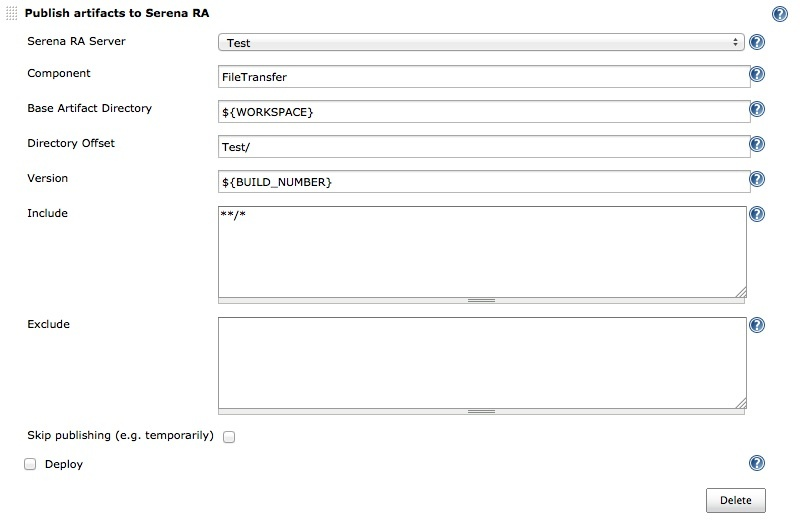

# Overview

This plugin integrates Jenkins with Serena Release Automation (SRA) the
Serena DevOps solution.

  
The plugin allows a Jenkins job to be associated with SRA, automatically
deploying any build artifacts through a configured DevOps process.

The plugin currently supports

-   Artifact upload to specified SRA repository
-   Artifact deployment using specified SRA deployment process

The current version of this plugin may not be safe to use. Please review
the following warnings before use:

-   [Credentials stored in plain
    text](https://jenkins.io/security/advisory/2019-04-03/#SECURITY-1066)

# Pre-requisites

This plugin currently supports the latest GA version of SRA. The plugin
uses both the Dimensions Java client and the SRA Java client to
interface against a specified SRA installation so requires that the
Jenkins installation be updated with a number of JAR files from the SRA
installation as document below.

# Installation

To run this plugin against a Jenkins installation, the following steps
need to be taken:-

-   The plugin needs to be installed and enabled using the Jenkins
    plugin manager using the *Available* tab in the usual manner. The
    name of the SRA plugin to select and install is *Serena SRA Deploy
    plugin*.

&nbsp;

-   The following JAR files need to be placed into the Jenkins class
    path or dropped into the *\<Jenkins\_Home\>/WEB-INF/lib* directory.
    These JAR files can be copied from the *\<DM\_ROOT\>/java\_api/lib/*
    and *\<DM\_ROOT\>/AdminConsole/lib/* directory of your Dimensions
    server installation or from your SRA installation.
    -   *darius.jar*
    -   *dmclient.jar*
    -   *dmfile.jar*
    -   *dmnet.jar*
    -   *urbancode-vfs-client-all.jar*
    -   *urbancode-vfs-common.jar*
    -   *urbancode-vfs-server.jar*
    -   *urbancode-vfs.jar*

&nbsp;

-   For SRA 4.5.1 and above, please use the following JARs.
    -   *jersey-bundle-1.2.jar*
    -   *jersey-client-1.2.jar*
    -   *jsr311-api-1.1.1.jar*
    -   *serenara-client-CURRENT.jar*
    -   *serenara-vfs-CURRENT.jar*

&nbsp;

-   For SRA 5.0 and above, please use the following JARs.
    -   *commons-fileutils-CURRENT.jar*
    -   *commons-util-CURRENT.jar*
    -   *serenara-client-CURRENT.jar*
    -   *serenara-vfs-CURRENT.jar*
    -   *jersey-bundle-1.2.jar*
    -   *jersey-client-1.2.jar*
    -   *jsr311-api-1.1.1.jar*
    -   *jettison-1.2.jar*

&nbsp;

-   The plugin uses a version of log4j which conflicts with the version
    that comes deployed by default in Jenkins. As such, it is necessary
    to update the Jenkins version to use version 1.2.17 at a minimum.
    Failure to do so will cause the plugin to fail with "method not
    found" exceptions.
-   If you wish to use this plugin with SSO, then the SRA server needs
    to be version 5.0.1 or higher.

Failure to follow the above steps will mean the plugin will not operate
correctly.

# Configuring the Plugin

The plugin can be configured to work with Serena Release Automation at
both the System level and at the individual job definition level.

### System Configuration

Configuring the plugin at the system level allows you to define what SRA
installations you can use with your build jobs. The configuration allows
you to add installation details for each SRA server that you want to use
and test their connection works.

An example screen shot is shown below. 

### Job Configuration

When you create a new build job, you need to configure the SRA server
that you are pushing your build artifacts to. You also need to add the
component you are loading artifacts into, the types of artifacts you are
including (or excluding) from the load, whether or not you are running a
deployment as part of the loading process and if so, what deployment
process(es) to follow.

An example screen shot of the available options is shown below. 

# Known Issues and Limitations

The following are a list of the current known issues and limitations
with this plugin

-   This plugin will support SSO, but only with SRA version 5.0.1+

# Up and Coming Changes

The following are a list of possible fixes and enhancement(s) to be
added to the next version of the plugin

-   TBD

# Version History

1.4.2.5 – Mar, 2014

-   Enhancement: Add options to validate various objects in SRA when
    creating/editing a configuration 

1.4.2.4 – Jan, 2014

-   Bugfix: Fix issue with Serena RA install URI mangling when
    /serena\_ra/ ends in a /
-   Enhancement: Revise doc dependencies for SRA 5.0.1

1.4.2.3 – Nov, 2013

-   Bugfix: Resolve more help text issues
-   Enhancement: Add SSO support for SRA 5.0.1+ only, will not work
    prior to SRA 5.0.1
-   Enhancement: Revise dependencies

1.4.2.2 – May, 2013

-   Resolve help text issue
-   Remove unnecessary package dependencies

1.4.2.1 – May, 2013

-   Initial release
