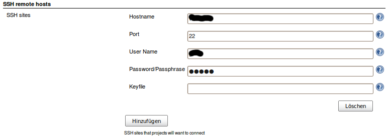

### Plugin info

This Plugin was derived from the very cool [SCP
Plugin](https://wiki.jenkins.io/display/JENKINS/SCP+plugin).You can use
the SSH Plugin to run shell commands on a remote machine via ssh.

------------------------------------------------------------------------

### Usage

First go to the global configuration page and add a SSH site.

{width="689"
height="245"}

For your job select a configured site and enter the shell commands that
should be executed before and after the build.

Log will look like this.

------------------------------------------------------------------------

### TODO

-   i18n
-   we also need a post deploy script (ask some of the core team how to
    do that)
-   investigate stop behavior of Hudson jobs using the ssh Plugin
-   use same sites as scp plugin (plugin dependencies???)
-   ...

------------------------------------------------------------------------

  

### Changelog

##### Version 2.6.1 (April 13 2018)

-   \[JENKINS-19973\] Option to hide ssh command in log

##### Version 2.6 (April 7 2018)

-   \[JENKINS-46172\] Handle NPE when not all fields are specified &
    save only properly configured sites

-   \[JENKINS-10128\] Set build to UNSTABLE when no SSH site is
    configured instead of NPE
-   Add Jenkinsfile to plugin
-   bump ssh-credentials dependency to 1.12
-   Add ajax validation to essential ssh host fields

INFO: the "Add Credentials" button for SSH Site **don't work** in recent
Jenkins 2.x versions - this will be fixed in upcoming 3.0 version.  
(major version since plugin will have to migrate it's configuration to
new format)

##### Version 2.5 (July 8 2017)

-   \[JENKINS-21436\] Integrate with the SSH Credentials Plugin;
    previous credentials are migrated

-   \[JENKINS-23231\] Add timeout parameter

-   \[JENKINS-24913\] Don't show sensitive build variables in console
    log

-   \[JENKINS-12191\] Restore resolving hostname from environment
    variables

-   \[JENKINS-12191\] Support build variables (substitution variables)
    during command execution (env variables are exported before the
    script)

-   \[JENKINS-24402\] Updated to latest version of JSch (0.1.54) to
    support modern algorithms

-   Pull JSch dependency via Jenkins hosted jsch-plugin to use
    recommended way of getting common dependencies in Jenkins

-   Set Jenkins 1.609.3 as the oldest supported version

-   Show warning for missing parameters during ajax form validation

-   Fix security issue

Due to added integration with SSH Credentials Plugin, **this version
might NOT be fully compatibile** with previous version. Sorry!

Please **backup your org.jvnet.hudson.plugins.SSHBuildWrapper.xml**
before upgrading to version 2.5.**  
**

##### Version 2.4 (Jan 08 2014)

-   ability to use variables when defining SSH host
-   miscellaneous fixes
-   added keep alive interval

##### Version 2.3 (Sep 24 2012)

-   fixed
    [JENKINS-15265](https://issues.jenkins-ci.org/browse/JENKINS-15265)

##### Version 2.2 (Sep 03 2012)

-   fixed [JENKINS-15005](https://issues.jenkins-ci.org/browse/JENKINS-15005)
    and
    [JENKINS-14420](https://issues.jenkins-ci.org/browse/JENKINS-14420)

##### Version 2.1 (Aug 14 2012)

-   configurable pty mode

##### Version 2.0 (Jun 26, 2012)

-   support multiple sites on the same machine

##### Version 1.6 (Jun 24, 2012)

-   support parameterized builds

##### Version 1.3 (Jun 25, 2011)

-   Run script on build step.
-   Fixed
    [JENKINS-9240](https://issues.jenkins-ci.org/browse/JENKINS-9240)

##### Version 1.2 (Feb 17, 2011)

-   Fix to avoid executing empty script.

##### Version 1.1 (Jun 2, 2010)

-   Removed isEmpty() for 1.5 comp; better input areas

##### Version 1.0 (Feb 24, 2010)

-   Initial release.
