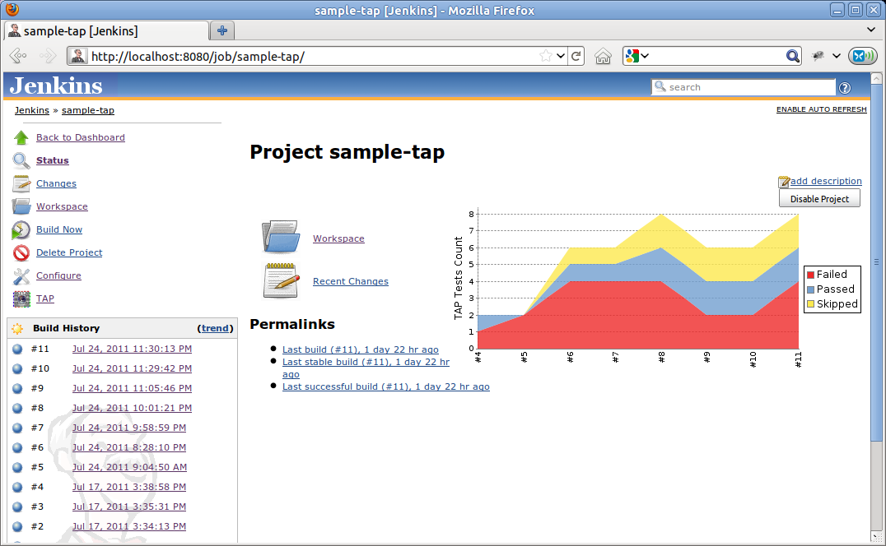
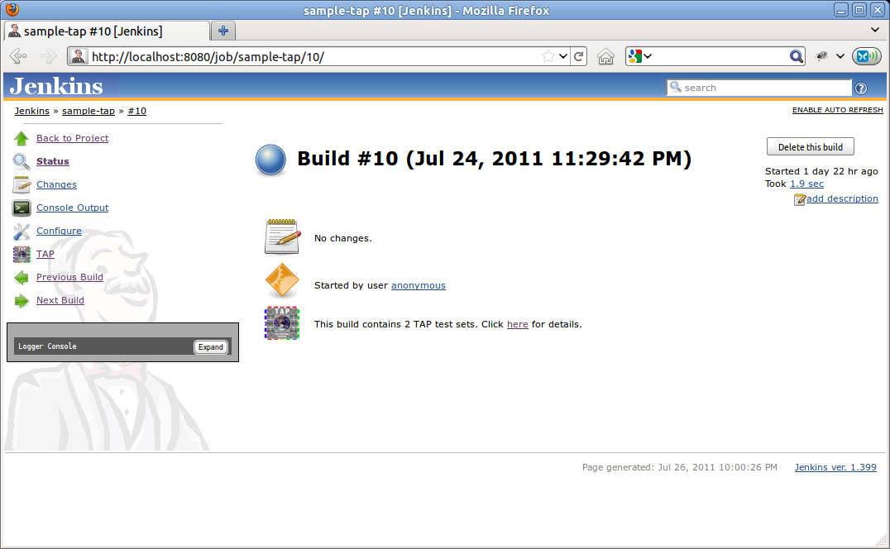
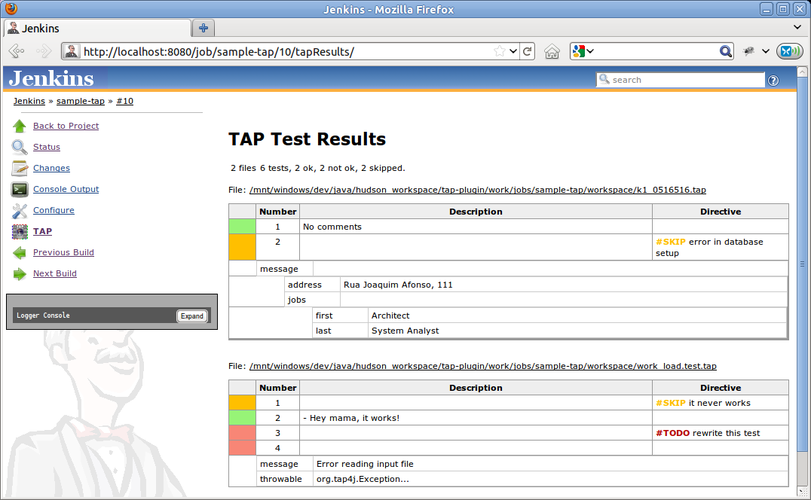

This plug-in adds support to [TAP](http://www.testanything.org/) test
result files to Jenkins. It lets you specify an [ant-like
pattern](http://ant.apache.org/manual/dirtasks.html#patterns) for a
directory that contains your TAP files.  
TAP Plug-in depends on [tap4j](http://www.tap4j.org/) - a TAP
implementation for Java, and on the [JUnit
Plug-in](https://wiki.jenkins-ci.org/display/JENKINS/JUnit+Plugin). You
may get errors if the JUnit Plug-in is not active in your Jenkins
instance (see
[JENKINS-27227](https://issues.jenkins-ci.org/browse/JENKINS-27227) for
more).

## Overview

The plug-in looks for TAP files like the following one.

``` syntaxhighlighter-pre
1..2
ok 1 - Yahoo!
not ok 2 - org.tap4j.Error...
```

When a TAP stream like the above is found, the plug-in delegates the
parsing the tap4j. The results of tap4j parsing are then analysed,
organized and displayed to the user as graphs and custom pages.

You can test your TAP streams with tap4j, using
[InstantTAP](http://instanttap.appspot.com/).

### Understanding TAP streams in 2 minutes

One of the easiest ways to learn something new is by examples. So here
we will show some examples of TAP streams. For being human-friendly, it
shouldn't confuse you. We will use comments to explain each line.

``` syntaxhighlighter-pre
1..2 # a plan stating that we have two tests cases, from 1 to 2.
ok 1 - Yahoo! # the first test result was executed successfully and has a description of ' - Yahoo!'.
not ok 2 - org.tap4j.Error... # unfortunately, the second test result failed. The description here was used to display some nasty Exception.
```

### Running Perl tests with prove

The plug-in cannot handle prove's default output (since it includes more
information than simply TAP, and causes tap4j parser to fail). The best
way to handle the prove output is by using Perl module
[TAP::Harness::Archive](http://search.cpan.org/~wonko/TAP-Harness-Archive-0.14/lib/TAP/Harness/Archive.pm).
Supposing you have your tests under t/ directory, you can create another
directory (say, output) and archive your TAP tests with prove by using a
command line similar to the below:

``` syntaxhighlighter-pre
prove t/ --archive output
```

The result files will be stored under *output/t/*. You can use a pattern
in the plug-in configuration like *t/\*****/****.t*.

### Using attachments

The following is a TAP with attachments, using YAMLish. If you are
familiar with YAML, this example should be very easy to read.

``` syntaxhighlighter-pre
1..2
ok 1
not ok 2 - br.eti.kinoshita.selenium.TestListVeterinarians#testGoogle
  ---
  extensions:
      Files:
          my_message.txt:
            File-Title: my_message.txt
            File-Description: Sample message
            File-Size: 31
            File-Name: message.txt
            File-Content: TuNvIGNvbnRhdmFtIGNvbSBtaW5oYSBhc3T6Y2lhIQ==
            File-Type: image/png
  ...
```

The Files entry has an array of files. You have to Base64 encode your
content data.

### Subtests (grouping or test suites).

Subtests let you group several TAP streams unto a single one. This way,
you can organize your tests in similar fashion to JUnit or TestNG test
suites. Indentation is important for TAP subtests.

Subtests and YAMLish are not officially in TAP 13 specification

``` syntaxhighlighter-pre
  1..3
  ok 1 - First test
      1..2
      ok 1 - This is a subtest
      ok 2 - So is this
        1..2
        ok 1 - This is a subtest
        ok 2 - So is this
  ok 2 - An example subtest
  ok 3 - Third test
```

## Configuration

1.  Install the Jenkins TAP Plug-in using the Plug-in Manager or
    manually by copying the .hpi (or .jpi) file
2.  Check the option to publish TAP, configure a pattern (and other
    settings)
3.  Execute your build and analyze the results

## Screenshots

#### Jenkins JUnit compatible reports and graphs



#### Custom actions for TAP too



#### YAMLish support



## Languages Supported

1.  English (American)
2.  Portuguese (Brazil)) Work in Progress
3.  Spanish (Thanks to [César Fernandes de
    Almeida](http://www.cesinha.com/)) Work in Progress

## Known Limitations

1.  If the file type of a TAP report is considered as binary by the
    Jenkins webserver then the TAP plugin doesn't consider this file for
    inclusion in TAP reports (see
    [\#15813](https://issues.jenkins-ci.org/browse/JENKINS-15813) for
    further details). To make sure your TAP report is considered for
    inclusion use e.g. the file name suffix .tap (so instead of a file
    named "*report*" use "*report.tap*").

## Compatibility Matrix

This plug-in is not developed for Hudson, and we don't fix bugs
happening in any version of Hudson.

|         |        |        |        |               |               |               |               |               |               |               |               |               |               |
|---------|--------|--------|--------|---------------|---------------|---------------|---------------|---------------|---------------|---------------|---------------|---------------|---------------|
| Plugin  | 1.0    | 1.1    | 1.2.x  | 1.3\~1.9      | 1.10          | 1.11          | 1.12          | 1.13          | 1.14          | 1.15          | 1.16          | 1.17          | 1.18+         |
| TAP     | 13     | 13     | 13     | 13            | 13            | 13            | 13            | 13            | 13            | 13            | 13            | 13            | 13            |
| Jenkins | 1.399+ | 1.399+ | 1.399+ | 1.399+        | 1.488+        | 1.488+        | 1.488+        | 1.488+        | 1.488+        | 1.488+        | 1.488+        | 1.488+        | 1.488+        |
| Hudson  | ?      | ?      | ?      | Not supported | Not supported | Not supported | Not supported | Not supported | Not supported | Not supported | Not supported | Not supported | Not supported |

## Open Issues

## Sponsors

[{width="300"}](http://www.tupilabs.com/)

For commercial support, please get contact us
via [@tupilabs](https://twitter.com/tupilabs)

## Resources

1.  This plug-in is going to be part of "Make your tests speak TAP"
    presentation in [JCertif](http://www.jcertif.com/) by [Bruno P.
    Kinoshita](http://www.kinoshita.eti.br/), in September 2011. In this
    presentation will be presented too the tap4j project, how to enable
    TAP in JUnit and TestNG, integrate [Perl](http://www.perl.org/) and
    [Java](http://www.oracle.com/java) tests and an [Eclipse TAP
    editor](https://github.com/kinow/tap-editor).
2.  Gábor Szabó (2009), Test Reporting system: Smolder wish-list
    \<<http://szabgab.com/blog/2009/07/test-reporting-system-smolder-wish-list.html>\>.
3.  Gábor Szabó (2009), Reporting Test Results
    \<<http://szabgab.com/blog/2009/04/reporting-test-results.html>\>
4.  [tap4j](http://www.tap4j.org/) - The TAP implementation for Java.
5.  [Test Anything Protocol](http://www.testanything.org/) (official
    webpage).
6.  [Performance tests with phantomjs and
    yslow](http://www.slideshare.net/guest94ab56d/2013-0717continuous-performancemonitoringwithjenkins)
    (uses the plug-in for plotting the TAP results)
7.  [TAP Plugin for
    Matlab](http://www.mathworks.com/help/matlab/ref/matlab.unittest.plugins.tapplugin-class.html)

JCertif 2011

[JCertif](http://www.jcertif.com/) - Make your tests speak TAP -
Speaker: [Bruno P. Kinoshita](http://www.kinoshita.eti.br/)  
September, 2011 - Brazzaville, Congo  


## Release Notes

##### 2.3 (2019-06-05)

1.  [tap4j dependency upgraded to 4.4.2
    version](https://github.com/jenkinsci/tap-plugin/pull/24)
2.  [enabled parsing of TAP documents with corrupted YAML
    content](https://github.com/jenkinsci/tap-plugin/pull/25)
    1.  New option in advanced, to remove corrupted YAML elements
        (should work after upgrading the plug-in, but remember to back
        up first anyway!)

##### 2.2.2 (2019-02-14)

1.  [ JENKINS-55787](https://issues.jenkins.io/browse/JENKINS-55787) -
    Getting issue details... STATUS

##### 2.2.1 (2018-02-07)

1.  [ JENKINS-48925](https://issues.jenkins.io/browse/JENKINS-48925) -
    Getting issue details... STATUS

##### 2.2 (2018-01-26)

1.  [ JENKINS-48925](https://issues.jenkins.io/browse/JENKINS-48925) -
    Getting issue details... STATUS

##### 2.1 (2017-02-28)

1.  [JENKINS-22250](https://issues.jenkins-ci.org/browse/JENKINS-22250):
    "fail the build if no test results are present" option doesn't fail
    the job
2.  [JENKINS-21456](https://issues.jenkins-ci.org/browse/JENKINS-21456):
    Plugin runs despite earlier errors
3.  Upgraded tap4j dependency from 4.2.0 to 4.2.1 (latest)

##### 2.0 (2016-08-20)

1.  [JENKINS-29649: don't overwrite existing
    junit-results](https://issues.jenkins-ci.org/browse/JENKINS-29649)
2.  [JENKINS-34000: Workflow/Pipeline Support for TAP
    Plugin](https://issues.jenkins-ci.org/browse/JENKINS-34000)
3.  [JENKINS-33779: TAP plugin: enable detailed output for TAP with
    subtests](https://issues.jenkins-ci.org/browse/JENKINS-33779)

##### 1.25 (2016-06-21)

1.  [JENKINS-23851: Expand env vars in the ant pattern
    field](https://issues.jenkins-ci.org/browse/JENKINS-23851)
2.  [JENKINS-17804: Add option to show only
    failures](https://issues.jenkins-ci.org/browse/JENKINS-17804)
3.  [JENKINS-29650: Don't use a build step synchronization, defaulting
    to NONE.](https://issues.jenkins-ci.org/browse/JENKINS-29650)
4.  [JENKINS-30751: Use same logic everywhere to say whether a test is a
    failure or not](https://issues.jenkins-ci.org/browse/JENKINS-30751)
5.  [JENKINS-24843: Copy duration from Tabulated
    Tests](https://issues.jenkins-ci.org/browse/JENKINS-24843)
6.  [pull request \#6: fix duration\_ms (thanks
    to @forrest79)](https://github.com/jenkinsci/tap-plugin/pull/6)
7.  [JENKINS-22016 via pull request \#10: Expand env vars in the ant
    pattern field (thanks
    to @evandy0)](https://issues.jenkins-ci.org/browse/JENKINS-22016)
8.  [SECURITY-85: \[tap\] Can read all files on file
    system](https://issues.jenkins-ci.org/browse/SECURITY-85)

##### 1.24 (2015-10-01)

1.  [JENKINS-19471: TAP parser does not conform to InstantTAP
    website](https://issues.jenkins-ci.org/browse/JENKINS-19471)
2.  [JENKINS-24505: Tests are not marked as skipped with TAP
    plugin](https://issues.jenkins-ci.org/browse/JENKINS-24505)
3.  [JENKINS-19676: TAP test description does not get
    escaped](https://issues.jenkins-ci.org/browse/JENKINS-19676)
4.  [JENKINS-27227: TAP plugin fails to load with
    java.lang.NoClassDefFoundError:
    hudson/tasks/test/AbstractTestResultAction](https://issues.jenkins-ci.org/browse/JENKINS-27227)
5.  [JENKINS-29153: tap plugin fails job when not have
    to](https://issues.jenkins-ci.org/browse/JENKINS-29153)

##### 1.23 (2015-05-23)

1.  [JENKINS-28508: Broken link on Tap
    Results](https://issues.jenkins-ci.org/browse/JENKINS-28508)

##### 1.22 (2015-03-07)

1.  [Pull request \#8 to add
    LICENSE.txt](https://github.com/jenkinsci/tap-plugin/pull/8)

##### 1.21

1.  Dropped

##### Version 1.20

1.  [JENKINS-22047: Add option to reduce noise in
    logs](https://issues.jenkins-ci.org/browse/JENKINS-22047)

##### Version 1.18

1.  Updated to tap4j-4.0.8
2.  [JENKINS-22047: Add option to reduce noise in
    logs](https://issues.jenkins-ci.org/browse/JENKINS-22047)
3.  [JENKINS-22036: NullPointer when there is no Test
    Plan](https://issues.jenkins-ci.org/browse/JENKINS-22036)
4.  [JENKINS-17960: Indicate if tests don't go to
    plan](https://issues.jenkins-ci.org/browse/JENKINS-17960)
5.  [JENKINS-21917: TAP results graph causes null pointer
    exception](https://issues.jenkins-ci.org/browse/JENKINS-21917)
6.  <https://github.com/jenkinsci/tap-plugin/pull/4>

##### Version 1.17

1.  [JENKINS-22047: Add option to reduce noise in
    logs](https://issues.jenkins-ci.org/browse/JENKINS-22047)
2.  [JENKINS-22036: NullPointer when there is no Test
    Plan](https://issues.jenkins-ci.org/browse/JENKINS-22036)
3.  [JENKINS-17960: Indicate if tests don't go to
    plan](https://issues.jenkins-ci.org/browse/JENKINS-17960)
4.  [JENKINS-21917: TAP results graph causes null pointer
    exception](https://issues.jenkins-ci.org/browse/JENKINS-21917)
5.  [Pull request \#4](https://github.com/jenkinsci/tap-plugin/pull/4)

##### Version 1.17

1.  [JENKINS-20924: Make plans optional in TAP via a
    configuration](https://issues.jenkins-ci.org/browse/JENKINS-20924)

##### Version 1.16

1.  Updated to tap4j-4.0.5 (better subtests handling)

##### Version 1.15

1.  [JENKINS-16325: TAP Parser can't handle the output from
    prove](https://issues.jenkins-ci.org/browse/JENKINS-16325)

##### Version 1.14

1.  Security bug reported by Kees J. via e-mail. This issue is related
    to exposing files that the user running Jenkins has access via the
    plug-in.

##### Version 1.13

1.  [JENKINS-17960: Indicate if tests don't go to
    plan](https://issues.jenkins-ci.org/browse/JENKINS-17960)

##### Version 1.12

1.  [JENKINS-18885: Parse errors with Git's TAP test suite, part
    2](https://issues.jenkins-ci.org/browse/JENKINS-18885)
2.  [JENKINS-17878: HTML test output in tapResults not
    escaped](https://issues.jenkins-ci.org/browse/JENKINS-17878)
3.  [JENKINS-17855: TAP Stream results summary page contains links that
    fail](https://issues.jenkins-ci.org/browse/JENKINS-17855)
4.  [JENKINS-17504: TAP Plugin generates bad detail links on
    "tapTestReport"
    page](https://issues.jenkins-ci.org/browse/JENKINS-17504)

##### Version 1.11

1.  [JENKINS-17859: TAP report table show failed test message on ALL
    tests after the failed
    one.](https://issues.jenkins-ci.org/browse/JENKINS-17859)
2.  [JENKINS-17855: TAP Stream results summary page contains links that
    fail](https://issues.jenkins-ci.org/browse/JENKINS-17855)
3.  [JENKINS-17941: Parse errors with Git's TAP test
    suite](https://issues.jenkins-ci.org/browse/JENKINS-17941)
4.  [JENKINS-17947: Nested TAP not parsed
    correctly](https://issues.jenkins-ci.org/browse/JENKINS-17947)
5.  [JENKINS-17504: TAP Plugin generates bad detail links on
    "tapTestReport"
    page](https://issues.jenkins-ci.org/browse/JENKINS-17504)

##### Version 1.10

1.  [JENKINS-17245: Tap plug-in can't find TAP
    attachments](https://issues.jenkins-ci.org/browse/JENKINS-17245)

##### Version 1.9

1.  [JENKINS-16262: Tap plug-in can't find TAP
    attachments](https://issues.jenkins-ci.org/browse/JENKINS-16262)

##### Version 1.8

1.  [JENKINS-15914: TAP results table misses first comment
    line](https://issues.jenkins-ci.org/browse/JENKINS-15914)
2.  [JENKINS-15322: NOTESTS in TAP response gives parse error and stack
    trace from
    plugin](https://issues.jenkins-ci.org/browse/JENKINS-15322)
3.  [JENKINS-15401: support TODO directive to not fail such
    tests](https://issues.jenkins-ci.org/browse/JENKINS-15401)
4.  [JENKINS-15907: When multiple TAP files with same basename match
    pattern, only one is
    processed](https://issues.jenkins-ci.org/browse/JENKINS-15907)

##### Version 1.7

1.  [JENKINS-15586: TAP plug-in is ignoring given file extension and
    looking for .tap
    files](https://issues.jenkins-ci.org/browse/JENKINS-15586)

##### Version 1.6

1.  [JENKINS-15419: TAP published results hide JUnit published
    results](https://issues.jenkins-ci.org/browse/JENKINS-15419)
2.  [JENKINS-15497: Display link to download TAP
    attachment](https://issues.jenkins-ci.org/browse/JENKINS-15497)

##### Version 1.2.7

1.  Removed requirement to have the TAP Plan at start or at the end of
    the TAP Stream. This way, TAP Streams generated using Perl
    done\_testing() now works well with the plug-in

##### Version 1.2.6

1.  Support JSON within YAMLish data

##### Version 1.1

1.  Support to Bail out!'s
2.  JENKINS-10562 TAP Plugin fails on slave

##### Version 1.0

1.  Initial design of the plug-in
2.  Custom UI for TAP test results
3.  JUnit-like graph that displays the test results per build (actually
    the graph was modeled using TestNG Plug-in as basis)

## Roadmap (wish list)

##### Version 1.x

1.  Add configurations like validate number of tests with test plan, a
    TODO causes a test to fail
2.  Diagnostics image gallery Done! Fixed as a [new
    plug-in](https://wiki.jenkins-ci.org/display/JENKINS/Image+Gallery+Plugin)
3.  Diagnostics exception code formatting
4.  Add a link to open the file in the Build workspace (think about
    remote and local issues) Done!

## History

The idea of the plug-in surged after tap4j was created. After learning
about Smolder, it became evident that Jenkins could be used as a
replacement for it. All that was needed was just adding TAP support to
Jenkins and implementing a nice UI to display the test results. After
some messages in jenkins-dev-list, Max and Nick commented about their
need to show test results in a different manner than how Jenkins was
doing at that moment. Soon after that Max, Nick, Bruno (tap4j) and Cesar
(tap4j) started to work together, exchanging mail messages and
discussing about a initial design for this plug-in.

In July 2011 the first version of the plug-in was ready to be released.
The graph code used here was adapted from TestNG Plugin (big thanks to
the development team, great work). The diagnostic (YAMLish) was
implemented in Jelly + Java + CSS. And the road map was incremented
based on what Gábor Szabó posted about Smolder and testing reports in
his blog (see resources for links).

## Simulating TAP streams with shell build steps

``` syntaxhighlighter-pre
#!/bin/bash


for x in {1..100}; do


cat > $x.tap <<EOF
ok 1
not ok 2
ok 3 # SKIP
not ok 4
ok 5
ok 6
ok 7
EOF


done ;
```
