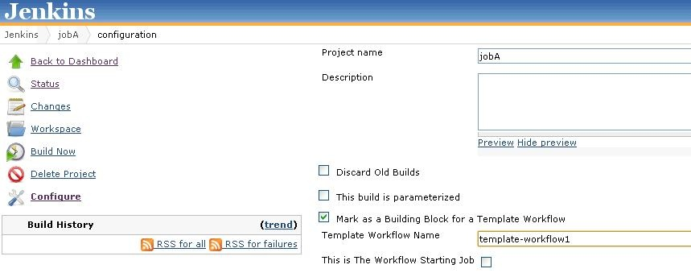
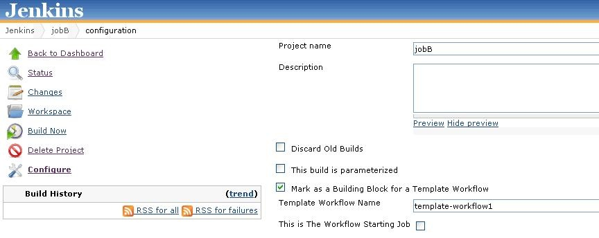
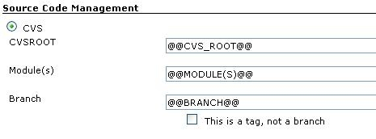
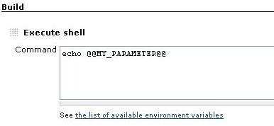
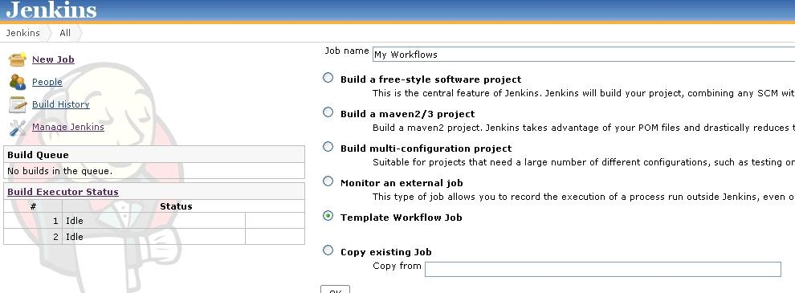
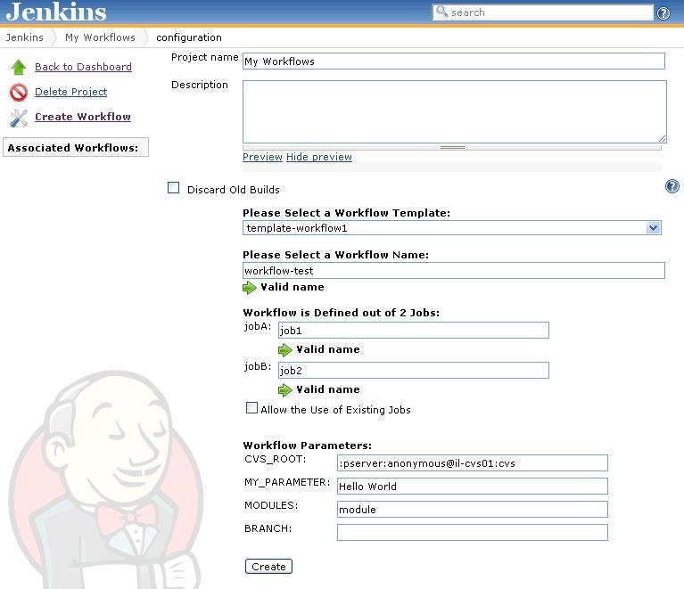
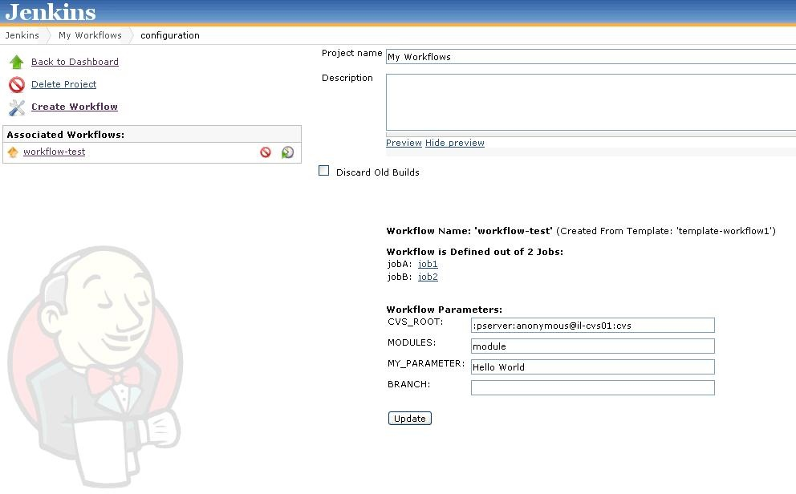

## Definition of a Workflow (AKA Build Flow or Pipeline):

A workflow is a set of jobs, these jobs may be linked (trigger each
other) and may share parameters.

## Introduction:

Jenkins is all about workflows. But creating, updating, duplicating or
deleting these workflows is not easy and takes time.  
Think about all the times you had to duplicate a set of jobs: duplicate
each job, link the jobs together and modify each job one by one so it
will be properly configured, didn't you ask yourself - why can't I just
define the workflow once and reuse this definition?  
This plugin introduces an easy way of managing workflows using the
Jenkins UI.

Plugin main features:

-   Define template workflows
-   Optionally share parameters between jobs in a template workflow
-   Create workflows from templates
-   Update workflows parameters easily
-   Execute workflows
-   Delete workflows
-   Full compatibility with other Jenkins plugins

## Defining Template Workflows:

Template workflows can be defined as any type(s) of jobs and each job
can be a member of several "template workflows".  
The definition is done from the job configuration screen, just mark the
job as a building block in a template workflow and state the template
workflow name.

Let's say we would like to define a simple template workflow called
"template-workflow1" which is made out of 2 jobs where one triggers the
other (jobA triggers jobB):

###### Definition of jobA:

**Definition of** **jobB****:**

Notes:

-   In order for a job to be a member of several template workflows,
    simply state all the workflows names (comma separated).
-   By checking the "This is The Workflow Starting Job" check box, this
    job will be scheduled when the workflow will be executed (more than
    one job can be selected as a starting point for a single template
    workflow). 

## 

## Defining Parameters for Template Workflows:

Parameters are also defined in the job configuration page and are
identified using a unique pattern: **@@**PARAMETER\_NAME**@@.**

You can define parameters wherever you like on the job configuration
page:

 
    

Notes:

-   In case two or more jobs are building blocks of the same template
    workflow - they share the same parameters, just define the same
    parameter name in the jobs configuration pages.  
-   By using this methodology (defining parameters by pattern), we are
    able to define parameters on any field we like (please refer also to
    the "Limitations & Workarounds" section).

## Create Workflows from Templates:

In order to create workflow we first have to create a new job type
called "**Template Workflow Job"**.

After creating the new job, we are now able to create workflows out of
our template workflows.

Open the new project and click the "**Create Workflow**" link, all the
defined template workflows will be automatically recognized.

1.  Select a workflow template (automatically shows all the related jobs
    and related parameters)
2.  Give your workflow a name (Must be unique for the current project)
3.  Select new jobs names for your workflow (These jobs will be created
    and associated in the current workflow)
4.  Fill the parameter values (these values will be populated in the
    above jobs configuration)
5.  Click the "Create" button

  

You will see that a new workflow has been added to your project in the
"Associated Workflows" side view.  
In our example, the workflow named "workflow-test" is made out of 2
jobs: job1 and job2.   
The relation between job1 and job2 has been derived from jobA and
jobB, meaning job1 triggers job2. Please notice that job1 and job2 are
configured with the workflow parameter values. 

You now have several options:

-   Create other workflows and associate them to your project.
-   Edit created workflow and update the workflow parameters (will
    update the workflow jobs configuration). 
-   Execute a workflow (Jobs that have been marked as the starting point
    for the workflow will be added to the build queue).
-   Delete a workflow (will also delete the jobs that were created
    during the workflow definition).

## Version Compatibility

This plugin was tested against Jenkins 1.477, but should work with
previous versions of Jenkins.

## Advanced configuration:

-   Sometimes you do not want to duplicate a specific job and just
    include it in your workflow.  
    In order to accomplish that, when creating the workflow - enter the
    existing job name and check the 'Allow the use of existing jobs'
    checkbox.
-   Explanation on how to configure the [Locks and Latches
    plugin](https://wiki.jenkins.io/display/JENKINS/Locks+and+Latches+plugin):
    create a lock with parameter pattern and configure your job with
    this lock.

## Limitations & Workarounds:

Some fields have validation (when submitting the job configuration
page), this prevents us from configuring parameter pattern in these
fields.  
In order to overcome this issue, you will have to manually configure the
template job config.xml (one time task) - replacing the specific field
value with parameter pattern.

## Releases:

##### \* Version 1.2: Initial release
