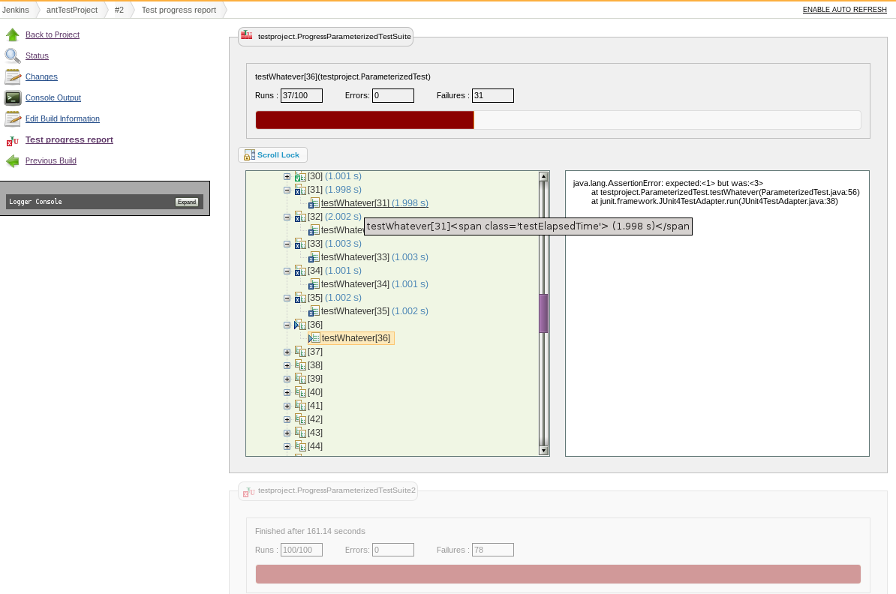

This plugin allows you to see how the tests progress during a build.

## About

While executing our tests on Jenkins most of us may have faced the need
of knowing which test is getting executed or if a test has failed then
whats the exception. As of now many of us completely depends on the
execution console for the same.

This plugin solves the said issue and present the user with a user
friendly UI to look at the progress and failures if any. This plugin
allows you to see how your unit tests progress during a build. It shows
you the details of running, skipped and failed test-methods/test-classes
of your test-suite.

It supports sequential execution for Junit and Spock based Unit test
framework and support parallel execution for TestNg.

Currently supported unit test frameworks:

-   [\#Junit](http://localhost:8085/display/JENKINS/Test+In+Progress+Plugin#TestInProgressPlugin-Junit)
-   [\#Spock](http://localhost:8085/display/JENKINS/Test+In+Progress+Plugin#TestInProgressPlugin-Spock)
-   [\#TestNg](http://localhost:8085/display/JENKINS/Test+In+Progress+Plugin#TestInProgressPlugin-TestNg)



## Using the plugin

### Plugin configuration

Check **Show tests in progress** in *Build Environment* section while
configuring your project in jenkins :


### Add testInProgress client library to your Unit Test Framework.

### Junit

Add **testInProgress-client-1.0.jar** to your test classpath. You can
find this library in the jenkins maven repository at
<http://repo.jenkins-ci.org/releases/org/jenkins-ci/plugins/testInProgress-client/>

If you use maven, add jenkins maven repository and add dependency to
testInProgress-client :

``` syntaxhighlighter-pre
    <repositories>
        <repository>
            <id>repo.jenkins-ci.org</id>
            <url>http://repo.jenkins-ci.org/public/</url>
        </repository>
    </repositories>
    <dependencies>
        <dependency>
            <groupId>junit</groupId>
            <artifactId>junit</artifactId>
            <version>4.10</version>
            <scope>test</scope>
        </dependency>
        <dependency>
            <groupId>org.jenkins-ci.plugins</groupId>
            <artifactId>testInProgress-client</artifactId>
            <version>1.0</version>
            <scope>test</scope>
        </dependency>
    </dependencies>
```

### Create a progress suite

Use *org.jenkinsci.testinprogress.runner.ProgressSuite* runner instead
of *org.junit.runners.Suite* to create your main suite :

``` syntaxhighlighter-pre
package testproject;

import org.jenkinsci.testinprogress.runner.ProgressSuite;
import org.junit.runner.RunWith;
import org.junit.runners.Suite.SuiteClasses;

@RunWith(ProgressSuite.class)
@SuiteClasses({ CalcTestsSuite.class, ParameterizedTest.class })
public class ProgressAllTestsSuite {

}
```

Instead you can use
*org.jenkinsci.testinprogress.runner.ProgressBatchSuite* which allows to
define a junit 4 test suite based on pattern matching.  
*org.jenkinsci.testinprogress.runner.ProgressBatchSuite* extends
*de.oschoen.junit.runner.BatchTestRunner* which is included in
testInProgress-client-1.0.jar. See BatchTestRunner project on github :
<https://github.com/oschoen/batch-test-runner>

``` syntaxhighlighter-pre
package de.oschoen.junit.runner;

import org.jenkinsci.testinprogress.runner.ProgressBatchSuite;
import org.junit.runner.RunWith;


@RunWith(ProgressBatchSuite.class)
@BatchTestRunner.BatchTestInclude("**.*Suite")
public class ProgressAllTests {
}
```

### Configure your build to run your progress suite

#### Using ant

Select your progress test suite(s) :

``` syntaxhighlighter-pre
<junit haltonfailure="no" printsummary="yes" showoutput="true">
    <formatter type="xml" />
    <batchtest fork="false" todir="${target.dir}/junit-xml">
        <fileset dir="${test}">
            <include name="**/ProgressAllTestsSuite.java" />
        </fileset>
    </batchtest>
    <classpath refid="project.test-classpath" />
</junit>
```

#### Using maven

``` syntaxhighlighter-pre
<build>
    <plugins>
        <plugin>
            <groupId>org.apache.maven.plugins</groupId>
            <artifactId>maven-surefire-plugin</artifactId>
            <version>2.13</version>
            <configuration>
                <includes>
                    <include>**/ProgressAllTestsSuite.java</include>
                </includes>
            </configuration>
        </plugin>
    </plugins>
</build>
```

### Spock

Add **testInProgress-spock-client-0.1.2.jar** to your test classpath.
You can find this library in the jenkins maven repository
at <http://repo.jenkins-ci.org/releases/org/imaginea/jenkins/plugins/testInProgress-spock-client/>.

Source code is available
at: <https://github.com/menonvarun/testInProgress-spock-client>

If you use maven, add jenkins maven repository and add dependency to
testInProgress-client :

``` syntaxhighlighter-pre
    <repositories>
        <repository>
            <id>repo.jenkins-ci.org</id>
            <url>http://repo.jenkins-ci.org/public/</url>
        </repository>
    </repositories>
    <dependencies>
        <dependency>
            <groupId>org.imaginea.jenkins.plugins</groupId>
            <artifactId>testInProgress-spock-client</artifactId>
            <version>0.1</version>
            <scope>test</scope>
        </dependency>
    </dependencies>
```

If you use Gradle, :

``` syntaxhighlighter-pre
   repositories {
            mavenCentral()
            mavenRepo urls: "http://repo.jenkins-ci.org/public/"
        }
    dependencies{
            testCompile "org.imaginea.jenkins.plugins:testInProgress-spock-client:0.1"
        }
```

Once done please follow the following steps:

-   Just add a file named
    "**org.spockframework.runtime.extension.IGlobalExtension**" under
    folder "**src/test/resources/META-INF/services**" under your source
    code.
-   Add the line
    "**org.imaginea.jenkins.testinprogress.spock.SpockTestInProgressExtension**"
    to the above mentioned file.Once the above steps are done your are
    good to go.Spock client supports disabling the client code execution
    by setting the property **"testinprogress.enabled"** to
    **"false"** while executing your tests.

### TestNg

Add **testInProgress-testng-client-0.1.jar** to your test classpath. You
can find this library in the jenkins maven repository
at <http://repo.jenkins-ci.org/releases/org/imaginea/jenkins/plugins/testInProgress-testng-client/>.

Source code is available
at: <https://github.com/menonvarun/testInProgress-testng-client>

If you use maven, add jenkins maven repository and add dependency to
testInProgress-client :

``` syntaxhighlighter-pre
    <repositories>
        <repository>
            <id>repo.jenkins-ci.org</id>
            <url>http://repo.jenkins-ci.org/public/</url>
        </repository>
    </repositories>
    <dependencies>
        <dependency>
            <groupId>org.imaginea.jenkins.plugins</groupId>
            <artifactId>testInProgress-testng-client</artifactId>
            <version>0.1</version>
            <scope>test</scope>
        </dependency>
    </dependencies>
```

If you use Gradle, :

``` syntaxhighlighter-pre
   repositories {
            mavenCentral()
            mavenRepo urls: "http://repo.jenkins-ci.org/public/"
        }
    dependencies{
            testCompile "org.imaginea.jenkins.plugins:testInProgress-testng-client:0.1"
        }
```

Once done please follow the following steps:

-   Just add the path
    "**org.imaginea.jenkins.plugins.testinprogress.testng.TestNGProgressRunListener**"
    as testng listener class to your test execution. This can be done
    either in testng.xml or maven pom.xml or even in ant's build.xml
    file.**Note: **The said client supports test to be executed in
    parallel. Each test section of a suite xml file will shown in a
    different section on the UI. The parallel execution only works if
    TestNg internal multi-threading concept is used.

## Change Log

##### Version 1.3 (August 05, 2014)

-   Changes done to support tests getting executed in parallel.
-   Some UI fixes related to display of executing tests.
-   Released TestNg client that supports tests to be executed in
    parallel.

##### Version 1.2 (May 08, 2014)

-   Changes the data transfer from string to JSON
-   Changes done to support other unit test frameworks other than Junit
-   Made changes to UI generation.
-   Released Spock client to support spock unit test framework.

##### Version 1.1 (July 01, 2013)

-   Added support for assumptions
-   Some bug corrections
-   Keep stacktrace and tree side by side

##### Version 1.0 (Feb 03, 2013)

-   Initial version
