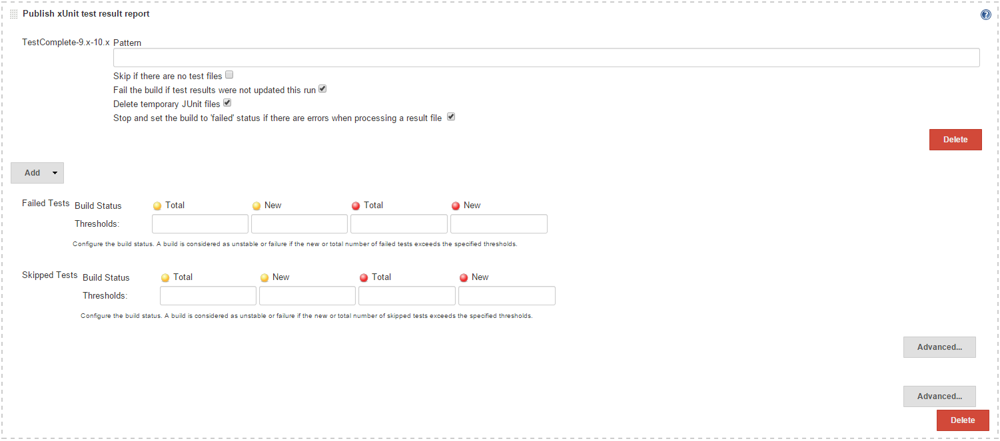
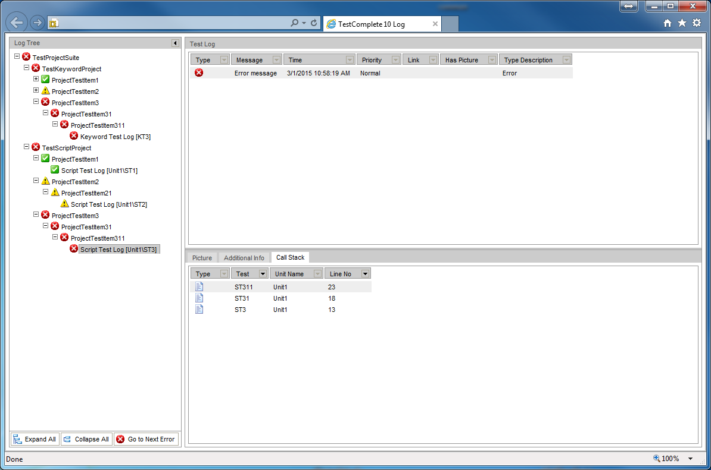
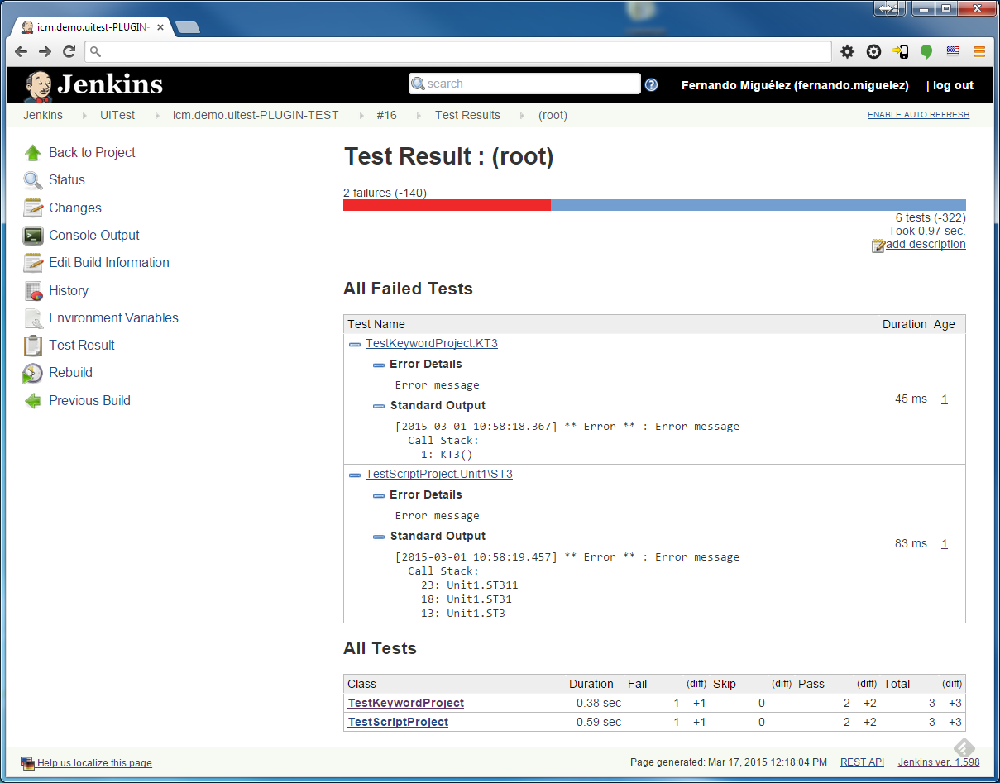

  

Jenkins Plugin that transforms
[TestComplete](http://en.wikipedia.org/wiki/TestComplete)
[MHT](http://en.wikipedia.org/wiki/MHTML) test reports into xUnit format
so they can be integrated with Jenkins' JUnit features.

## How it works

It has been developed as a [xUnit
Plugin](http://localhost:8085/display/JENKINS/xUnit+Plugin) extension.
To use it select the build step "Process xUnit test result report" or
"Publish xUnit test result report" post-build action. In either case
click on "Add" button and select "TestComplete-9.x-10.x" from drop down
list.

{width="60%"
height="60%"}

In the "TestComplete-9x-10.x Pattern" text box introduce the location of
the MHT report files as generated by TestComplete/TestExecute.

Some considerations:

-   Tests in TestComplete can be organized in a tree of test items.
    JUnit reports (xUnit) however can only be organized in two levels
    (testsuites and testcases contained within). TestComplete's keyword
    and script tests are then mapped to test cases and test suite is
    mapped as top-level test item containing keyword or script tests at
    any level.
-   For each resulting test case the classname is obtained as the name
    of the second-level ancestor test item (if any) containing the
    original keyworkd or script test. 

To illustrate these considerations consider following example
TestComplete report that belongs to a test suite that contains two top
TestComplete projects.

{width="60%"
height="60%"}

This is the resulting xUnit report. The xUnit test suite name matches
TestComplete's TestSuite name ("TestProjectSuite"). Test cases are named
after keyword tests (e.g. "KT3") and script tests (e.g. "Unit\\ST3").
The class names correspond to the names of the TestComplete projects in
suite (second level test items in report).

{width="60%"
height="60%"}

This plugin has been successfully tested on Linux, Windows and MacOSX.

## Change Log

##### Version 1.1 (25 Mar, 2015)

-   **NEW**. Added TestComplete 9.x support. Thanks to Krystian Przybyła
    for providing feedback and reports in TC9 format. Main improvement
    of TC10 over TC9 is millisecond resolution support for timing
    information (timestamps and durations).
-   **BUG**. Single test reports generated xUnit output format were not
    renderable by Jenkins

##### Version 1.0 (17 Mar, 2015)

-   First version.
