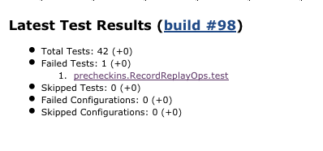
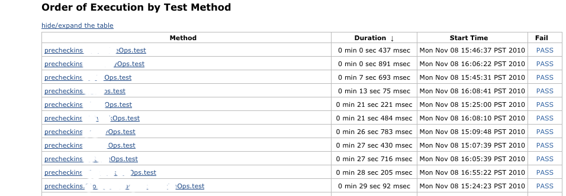
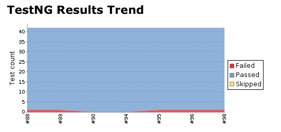

This plugin allows you to publish TestNG results generated
using `org.testng.reporters.XMLReporter`.TestNG result xml file contains
more information than the junit report xml file . This plugin exposes
those extra information in graph and table reports.

This plugin makes it possible to import TestNG XML reports from each
build into Jenkins.

The data is parsed using the output generated using
`org.testng.reporters.XMLReporter`. The results are displayed with a
trend graph and all details about which tests that failed are also
presented.

### Features

The page layouts are intentionally designed to look very similar to
Jenkins's JUnit plugin.

-   In the project/build page you can see a summary of passed/fail tests
    as well as passed/fail configuration methods. It also enlists the
    failed test cases with a direct link to view the test failure.

-   In the Class result summary page test methods are separated from
    configuration methods

-   In the Package result summary you can see the order which test
    methods were ran during the regression run.

-   Different graphs will show you the pass/failed trend of job's
    previous results.

-   Able to hide/expand tables that display package and class results

### Usage

Once you have configured your build to run TestNG based test cases and
also generate the TestNG specific result XML, using this plugin is very
simple. In **Post-Build Actions**, simply enable **Publish TestNG
Results**. This option allows you to configure the following properties:

-   **TestNG XML report pattern**: This is a file name pattern that can
    be used to locate the TestNG XML report files (for example
    **\***/target/testng-results.xml\*). The path is an Ant-style
    pattern (e.g. fileset) or a list of files and folders separated by
    the characters '***;:,***'. TestNG must be configured to generate
    XML reports using \_org.testng.reporters.XMLReporter \_for this
    plug-in to function.
-   **Escape Test Description string?**: If checked, the plug-in escapes
    the description string associated with the test method while
    displaying test method details. Unchecking this allows you to use
    HTML tags to format the description. (*enabled by default*).
-   **Escape exception messages?**: If checked, the plug-in escapes the
    test method's exception messages. Unchecking this allows you to use
    HTML tags to format the exception message e.g. embed links in the
    text. (*enabled by default*)
-   **Show Failed Builds?**: If checked, the plug-in includes results
    from failed builds in the trend graph. (Disabled by default). 
    -   If this is a maven build, it is better to configure the build
        step with `-Dmaven.test.failure.ignore=true` option. This
        results in build with test failures being marked as Unstable,
        thus distinguishing it from build that failed because of non
        test related issues 
    -   Even when this option is selected, failed builds with no results
        and aborted builds will not be displayed in graphs
-   **Mark build as unstable on Skipped config/test methods?**: Marks
    the build unstable of skipped configuration or test methods are
    found in results. If build result is worse that UNSTABLE, this
    option has no effect
-   **Mark build as failure on failed configuration?**: Marks the build
    as failed if there are any configuration method failures
-   **Thresholds for marking the build as Unstable/Failed**: User can
    configure a Threshold Mode as number of tests or percentage of tests
    and then configure these values separately as well. This allows for
    scenarios where we want the builds to be marked successful even when
    there are some test failures or mark the build as failed even if
    there is a single test method failure.

#### Pipeline in Jenkinsfile

According to  [
JENKINS-27121](https://issues.jenkins.io/browse/JENKINS-27121) - Getting
issue details... STATUS   [
JENKINS-46979](https://issues.jenkins.io/browse/JENKINS-46979) - Getting
issue details... STATUS ..

    post {
            always {
                step([$class: 'Publisher', reportFilenamePattern: '**/testng-results.xml'])
            }
    }

# Open Issues

type

key

summary

assignee

reporter

priority

status

resolution

created

updated

due

Data cannot be retrieved due to an unexpected error.

[View these issues in
Jira](https://issues.jenkins-ci.org/secure/IssueNavigator.jspa?reset=true&jqlQuery=project=Jenkins%20AND%20component=testng-plugin%20AND%20status%20in%20%28%22In%20Progress%22,%20Open,%20Reopened%29%20ORDER%20BY%20priority,%20status,%20createdDate%20ASC&src=confmacro)

## Change Log

### **Release 1.15 (June 28th, 2018)**

-   Fixed: JENKINS-32746 - Change loop determination condition in order
    to check all loaded builds (Julien Herr)
-   Fixed: JENKINS-26971 - Looking at failed TestNG result causes an
    exception (Vladimir Sitnikov)
-   Added: JENKINS-51341 - Display suite name at main page and at method
    result page (Vladimir Sitnikov)
-   PR-35 - Show "failed configurations" earlier than "failed tests"
    (Vladimir Sitnikov)

### **Release 1.14 (July 5th, 2016)**

-   Added: Update to new parent POM (jglick)
-   Added: JENKINS-27121 - Pipeline compatibility (jglick)
-   Fixed: General code quality fixes (faisal-hameed)
-   Added: Added some basic form validation

### **Release 1.13 (May 15th, 2016)**

-   Fixed: JENKINS-34822 - TestNG plugin has incorrect default threshold
    values

### **Release 1.12 (May 10th, 2016)**

-   Fixed: JENKINS-34711 - NullPointerException after Update to 1.11 of
    plugin

### **Release 1.11 (May 8th, 2016)**

-   Added: Add ability to configure failed/skipped test thresholds
    (ChrisEverling) (see JENKINS-20985)

### **Release 1.10 (March 31st, 2015)**

-   Upped compatible Jenkins version to v1.554.3
-   Added: MIT license
-   Added: Add property to fail build on config fail (damienbiggs)
-   Added: Make sure TestNGTestResultBuildAction caches counts and loads
    results lazily (Jesse Glick)

### **Release 1.9.1 (August 13th, 2014)**

-   Make duration calculation for PackageResults more accurate
-   Retain white-space formatting in reporter output (steveims)

### **Release 1.9 (August 11th, 2014)**

-   Fixed the duration values to be more accurate by accounting for
    tests executing in parallel
-   Fixed: JENKINS-24176 - Test result trend breaks lazy-loading (Jesse
    Glick)
-   Fix default value of testng.reportFilenamePattern (juherr)

### **Release 1.8 (July 20th, 2014)**

-   Fixed: Added back package names in certain places where they were
    helpful (see JENKINS-19217)

### **Release 1.7 (June 28th, 2014)**

-   Fixed: JENKINS-23285 - All links on trend graph map are wrong on
    "testngreports" subpage
-   Fixed: JENKINS-19217 - Change class names to not contain package
    names on result pages

### **Release 1.6 (Feb 9th, 2014)**

-   Fixed: JENKINS-19353 - Exception error message newlines are escaped
-   Fixed: JENKINS-20968 - Doesn't resolve parameters in "TestNG XML
    report pattern" field
-   Moved some configuration into Advanced section and cleaned up help
    sections
-   Added: JENKINS-20438 - Make it an option to show failed builds in
    trend graph
-   Added: New option to mark build as unstable on finding skipped
    config or test methods

### **Release 1.5 (Aug 15th, 2013)**

-   Fixed: JENKINS-19157 - Make st:bind work when Jenkins has jQuery
    plugin installed
-   Added: failure details to failed configuration methods on TestNG
    results page

### **Release 1.4 (Aug 6th, 2013)**

-   **Bumped up supported Jenkins version to v1.526 or later**
-   Integrated TestNG plugin results into email-ext plugin

### **Release 1.3 (Jul 22nd, 2013)**

-   Added: JENKINS-11899 - Print all URLs as HTML anchors (when escaping
    description and exception message)
-   Added: JENKINS-12275 - TestNG plugin should contribute to Dashboard
    View plugin
-   Fixed: JENKINS-18750 - NPE in testng graph
-   Fixed: JENKINS-17564 - Reporter output being escaped incorrectly

### **Release 1.2 (Jun 30th, 2013)**

-   Added: Error details to failed test list
-   Fixed: JENKINS-18498 -
    hudson.tasks.test.AggregatedTestResultAction$1 cannot be cast to
    hudson.tasks.test.TestResult
-   Fixed: JENKINS-16832 - Do not show failed builds in trend graph
-   Fixed: JENKINS-18206 - Total duration of a test class should include
    the times for the configuration methods

### **Release 1.1 (Feb 1st, 2013)**

-   Fixed: JENKINS-16592 - Invalid URL in testngreport on tests
    execution history chart

### **Release 1.0 (Jan 21st, 2013)**

-   Added: Implement AbstractTestResultAction
-   Removed: deprecated class BuildIndividualReport (deprecated since
    v0.23)
-   Removed: deprecated fields isRelativePath, results, fullName (were
    deprecated since v0.23 or earlier)
-   Changed: duration in results to be seconds instead of milliseconds
    (as we now implement AbstractTestResultAction)
-   Removed: Commented out Age column from reports as it wasn't
    symmetrical to Junit reports. Needs re-implementation
-   Fixed: JENKINS-16374 - Allow concurrent builds for Projects using
    TestNG plugin to proceed

### **Release 0.33 (Jan 06th, 2013)**

-   **Upped compatible Jenkins version to v1.447**
-   Fixed: JENKINS-15119 - Duration sorting is incorrect in TestNG
    report
-   Fixed: JENKINS-12046 - TestNG shouldn't look for result files if
    build was aborted (again!)
-   Added: JENKINS-10832 - make testng reporter-output field viewable
    from testng-plugin generated reports (Dan Alvizu)

### **Release 0.32 (February 14th, 2012)**

-   Fixed: JENKINS-12648 - Results should be reported for failed/aborted
    builds as well (Reverted fix for JENKINS-12046 in v0.30)

### **Release 0.31 (January 31st, 2012)**

-   Fixed: JENKINS-12187 - Ignore testng XMLs (if any) from previous
    builds
-   Fixed: JENKINS-12494 - NPE while parsing testng xml with empty full
    stacktrace and no short stacktrace (Benoit Guerin)
-   Fixed: JENKINS-12567 - skipped tests and configurations shouldn't
    mark the build as unstable (Christoph Kutzinski)

### **Release 0.30 (January 22nd, 2012)**

-   Fixed: JENKINS-12046 - TestNG shouldn't look for result files if
    build was aborted
-   Fixed: JENKINS-11158 - Don't fail build if result files cannot be
    found
-   Added: More logging around what the plugin is doing
-   Improved TestNG trend graph accuracy. It now shows all builds, even
    ones for which there were no TestNG results

### **Release 0.29 (December 4th, 2011)**

-   Fixed: JENKINS-11236 - TestNG plugin links to wrong document
    (kohsuke)
-   Fixed: JENKINS-11045 - Hold TestNG Results in memory using weak
    references
-   Performance improvements (kutzi)
-   Improve Load time for graphs (kutzi) + trivial cleanup

### **Release 0.28 (September 20th, 2011)**

-   Bumped up supported Jenkins version to v1.403 or later
-   Fixed: JENKINS-9918 - Limit the number of rows in method execution
    order table

### **Release 0.27 (September 11th, 2011)**

-   Added: JENKINS-10882 - Add duration in the XML API for test-result,
    package and classes [Nicolas De
    Loof](https://wiki.jenkins.io/display/JENKINS/testng-plugin#)
-   Added: JENKINS-10018 - New graph for test method details page

### **Release 0.26 (July 6th, 2011)**

-   Added: JENKINS-8926 - Add group name to class test methods page
-   Added: JENKINS-9969 - Store/Display user provided custom test name

### **Release 0.25 (June 24th, 2011)**

-   Fixed: JENKINS-10000 - Config methods for classes with no test
    methods are not displayed
-   Added: JENKINS-10001 - Store/Display group names (if any) for test
    methods
-   Added: JENKINS-10098 - Add test/suite names to class results page

### **Release 0.24 (June 13th, 2011)**

-   Fixed: JENKINS-9742 - Test Report exposes data via the Remote APIs
    now

### **Release 0.23 (June 8th, 2011)**

-   Fixed: JENKINS-9835 - Remove isRelativePath option
-   Fixed: JENKINS-9836 - Start storing testng-results.xml with build
    artifacts
-   Moved help information from configuration options to help.html
-   Fixed: JENKINS-9839 - Fix graph refresh after a build is deleted
-   Added: JENKINS-9837 - capture parameters used to run the test method
-   Changed to start appending '\_x' where 1\<=x\<=n to test method
    names in urls  
    to disambiguate multiple tests with same name from same class. This
    stops  
    using the UUID that was being associated with all the test methods.

(**NOTE**: There is a slight break in backward compatibility in this
release.  
URLs for older data for test methods will change. Also, significant code
changes and  
features have been introduced in this version. Older builds might face
some issues,  
though the chances are very low.)

### **Release 0.22 (May 29th, 2011)**

-   A whole lot of code cleanup. Removed a lot of unnecessary classes.
    No new features.

### **Release 0.21 (May 20th, 2011)**

-   Have checkboxes for escaping test description and exception message
    selected by default
-   Changes to how exceptions are displayed. No need to repeat message,
    highlight exception class etc
-   Removed code supposed to make this work as Maven plugin. Was all
    unnecessary code.
-   Fixed NPE because of GroupTestRun

### **Release 0.20 (May 9th, 2011)**

-   New: JENKINS-9605 - Add option to not HTML-sanitize localized
    messages of exceptions

### **Release 0.19 (May 2nd, 2011)**

-   Fixed: JENKINS-9083 - fix urls in results trend chart (wasn't
    completely fixed in v0.18)

### Release 0.18 (April 28th, 2011)

-   Fixed: JENKINS-9083 - handle jenkins context path in URLs properly
-   Updated pom dependency to jenkins 1.399

### Release 0.17 (April 24th, 2011)

-   Fixed JENKINS-9299 : test results trend chart not showing
-   Updated pom dependency to jenkins 1.396

### Release 0.16 (March 25th, 2011)

-   Fixed the breakage for new jenkins build because we were using
    ChartUtil class methods which are deprecated in hudson since 1.320
-   Bumped the dependency revision to jenkins 1.395. This plugin now
    only works with jenkins. Shoot me an email if you are still using
    Hudson and I will try to release a version for hudson as well.

### Release 0.15 (March 24th, 2011)

-   Fixed JENKINS-9002 : cssClass is not set properly for ClassResult
    view in testng-plugin
-   Fixed JENKINS-8976 : testng plugin is not able to differentiate
    between multiple test-methods run as part of the same \<class\> in
    data provider mode
-   Fixed JENKINS-9157 : Package results should now aggregate up the
    duration totals correctly

### Release 0.14 (February 18th, 2011)

-   Fixed JENKINS-8828 : exception.message is not displayed correctly
    for failed tests
-   Fixed JENKINS-7916 : FormatUtil method is using TimeUnit.toMinutes
    which is not defined in Java 1.5

### Release 0.12 (February 12th, 2011)

-   Fixed : The plugin wasen't showing all the @Test methods which ran
    as part of the same class. For example you can have multiple @Test
    methods in the same class with couple of @Before and @After
    methods.Release 0.11 (February 8th, 2011)
-   Fixed : diff value was display as --3 instead of 3 and -3 instead of
    +3
-   Fixed : Checked in the missing sidebar icon files

### Release  0.7 (October 25, 2010)

-   Fixed: Plugin fails to find testng-results.xml file when project is
    configured to checkout sources from SVN SCM.

### Release  0.5 (September 24, 2010)

-   Fixed: parser test cases were failing with IOException
-   Fixed: Updated colors for Trend Graph to match JUnit graph and bar
    colors
-   Fixed: Better display of content on the test method result page
-   Fixed: Open/Close js behavior on Package results page
-   Fixed: Removed a lot of dead code and unnecessary files
-   Fixed: Trend Graph is shown for Projects and not for Builds
-   Changed: TestNG Results link at Project page doesn't take you to
    latest build results anymore
-   New: Trend graph has tooltips and links to different builds

### Release  0.4 (August 17, 2010)

-   New: Initial release

### Release  0.1 (August 12, 2010)

-   First Revision
