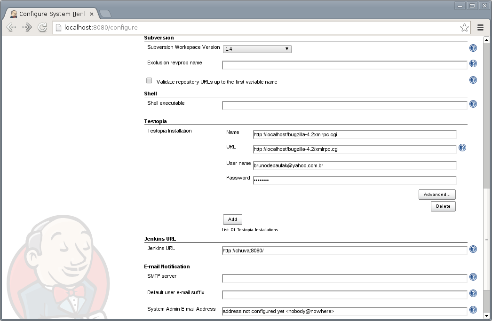
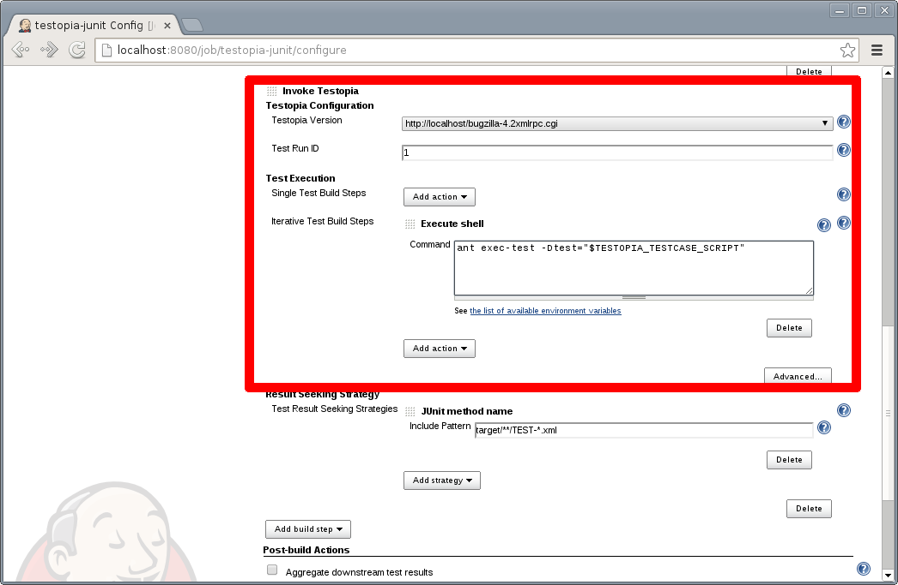
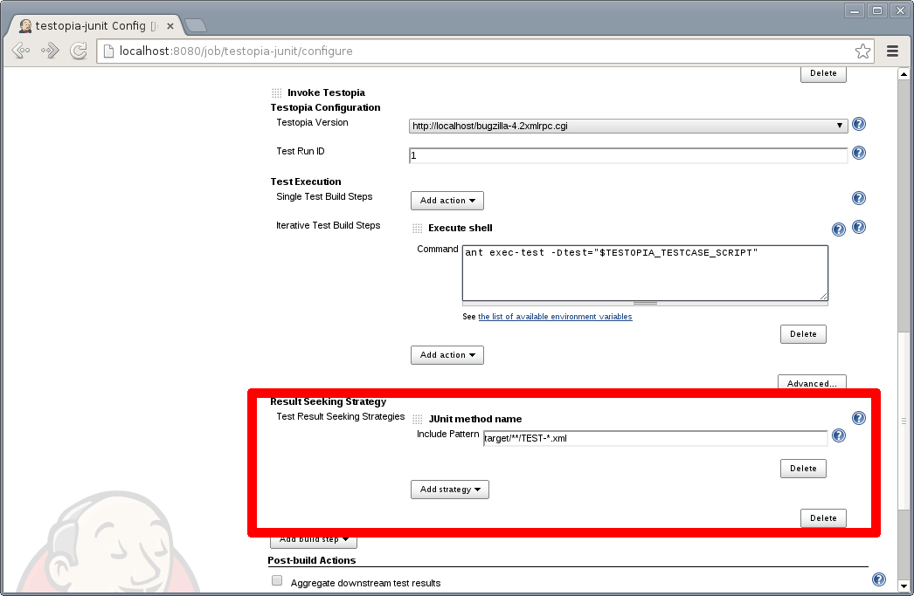

**This plugin is up for adoption.** Want to help improve this plugin?
[Click here to learn
more](http://localhost:8085/display/JENKINS/Adopt+a+Plugin "Adopt a Plugin")!

This plug-in integrates **Jenkins** with Testopia and generates reports
on automated test execution. With this plug-in you can manage your tests
in Testopia, schedule and control in **Jenkins**, and execute using your
favorite test execution tool (TestPartner, Selenium, TestNG, Perl
modules, prove, PHPUnit, among others).

When filing an issue, remember to include as much data as possible, but
avoid including sensitive data, as attachments can take a while to be
deleted from JIRA, as the process is manual and quite
troublesome 

## Description

The Testopia plug-in
integrates **Jenkins** with [Testopia](http://www.mozilla.org/projects/testopia).
Testopia plug-in
uses [testopia-java-driver](https://github.com/kinow/testopia-java-driver) to
access Testopia **XML-RPC** API. With the information that you provide
in the build step configuration the plug-in **retrieves automated tests
from Testopia**. With the plug-in, you are able to execute **build
steps** that call testing tools. It
reads **TestNG**, **JUnit** and **TAP** test report **formats**, used to
update Testopia test cases' executions.

#### **Testopia configuration section**

#### Test Execution section

#### Result Seeking Strategy section

You can use environment variables. 

#### How does the plug-in execute my automated tests?

Testopia Plug-in retrieves automated test cases data from Testopia. This
data is then set as environment variables. This way your build steps can
make use of this information to execute your automated tests.

For instance, you could run a ant command passing a Test Class as
parameter, more or less something like this,
/opt/java/apache-ant-1.8.0/bin/ant
-DtestClass=$TESTOPIA\_TESTCASE\_SCRIPT. In this case,
TESTOPIA\_TESTCASE\_SCRIPT the value of the script automation field in
Testopia.

List of environment variables available during Testopia Plug-in
execution:

##### **Already implemented:**

###### **Test run info**

-   TESTOPIA\_TESTRUN\_ID
-   TESTOPIA\_TESTRUN\_BUILD
-   TESTOPIA\_TESTRUN\_ENVIRONMENT
-   TESTOPIA\_TESTRUN\_MANAGER
-   TESTOPIA\_TESTRUN\_NOTES
-   TESTOPIA\_TESTRUN\_PRODUCT\_VERSION
-   TESTOPIA\_TESTRUN\_SUMMARY
-   TESTOPIA\_TESTRUN\_CASES
-   TESTOPIA\_TESTRUN\_PLAN\_ID
-   TESTOPIA\_TESTRUN\_PLAN\_TEXT\_VERSION
-   TESTOPIA\_TESTRUN\_RUN\_ID
-   TESTOPIA\_TESTRUN\_STATUS
-   TESTOPIA\_TESTRUN\_TARGET\_COMPLETION
-   TESTOPIA\_TESTRUN\_PLAN\_TARGET\_PASS

###### Test case info

-   TESTOPIA\_TESTCASE\_ID
-   TESTOPIA\_TESTCASE\_RUN\_ID
-   TESTOPIA\_TESTCASE\_BUILD\_ID
-   TESTOPIA\_TESTCASE\_SCRIPT
-   TESTOPIA\_TESTCASE\_ALIAS
-   TESTOPIA\_TESTCASE\_ARGUMENTS
-   TESTOPIA\_TESTCASE\_REQUIREMENT
-   TESTOPIA\_TESTCASE\_SORT\_KEY
-   TESTOPIA\_TESTCASE\_SUMMARY
-   TESTOPIA\_TESTCASE\_AUTHOR\_ID
-   TESTOPIA\_TESTCASE\_CATEGORY\_ID
-   TESTOPIA\_TESTCASE\_DEFAULT\_TESTER\_ID
-   TESTOPIA\_TESTCASE\_PRIORITY\_ID
-   TESTOPIA\_TESTCASE\_STATUS\_ID
-   TESTOPIA\_TESTCASE\_AUTOMATED
-   TESTOPIA\_TESTCASE\_CREATION\_DATE
-   TESTOPIA\_TESTCASE\_ESTIMATED\_TIME
-   TESTOPIA\_TESTCASE\_ESTIMATED\_ENV\_ID

#### How does the plug-in know if a test passed or failed?

You can choose among different **result seeking strategies** in your job
configuration. The plug-in will support three **result
formats**, *TestNG*, *JUnit* and *TAP*. 

**Already implemented:**

-   [TAP](http://testanything.org/) (using
    [tap4j](http://www.tap4j.org/))
-   JUnit (using Jenkins built-in parser)
-   TestNG (using
    [testng-parser](http://repo2.maven.org/maven2/com/tupilabs/testng-parser/))

###### TAP result seeking strategies

**TAP file name**: The plug-in matches the TAP file name (e.g.:
testFtpProtocol.tap) and the key custom field value.

##### Does the plugin record the test results in Testopia?

Yes, the plugin will update the testcase in Testopia and set the status
according to the result of the testcase.

## Configuration

1.  Download and install the latest version of Testopia
    (<http://www.mozilla.org/projects/testopia>).
2.  Create automated tests in Testopia (Check automated field).
3.  Install the Testopia plug-in from the Jenkins Plugin Manager
4.  Define a Testopia configuration from the Configure System page.
5.  Add a Invoke Testopia build step in the job you want execute
    automated tests.
6.  Configure the required properties.

## Languages Supported

1.  English (American)
2.  Dutch (the Netherlands)
3.  Portuguese (Brazil)

Want to see this plug-in in your language? Send us an e-mail and we will
get in touch with the text that needs to be translated.

## Compatibility Matrix

We don't maintain the plug-in for Hudson. Issues happening in Hudson may
not be fixed here.

[TABLE]

## Issues

type

key

summary

assignee

reporter

priority

status

resolution

created

updated

due

Data cannot be retrieved due to an unexpected error.

[View these issues in
Jira](http://issues.jenkins-ci.org/secure/IssueNavigator.jspa?reset=true&jqlQuery=project%20=%20JENKINS%20AND%20status%20in%20%28Open,%20%22In%20Progress%22,%20Reopened%29%20AND%20component%20=%20%27testopia-plugin%27&tempMax=1000&src=confmacro)

## Resources

Testopia Plug-in used TestLink Plug-in as basis. Below you will find
resources for Testopia and TestLink plug-ins, as the concept in both
plug-ins is very similar.

1.  [Article](http://www.kinoshita.eti.br/wp-content/uploads/2010/12/testingexperience12_12_10_Kinoshita_Santos.pdf) published
    in [Testing Experience
    magazine](http://www.testingexperience.com/) issue number 12 (Open
    Source Tools) written by [Bruno P.
    Kinoshita](http://www.kinoshita.eti.br/) and Anderson dos
    Santos. 2010.
2.  [Slides](http://www.scribd.com/doc/43729582/Automatizando-Testes-Com-Hudson-e-TestLink) used
    in the lighting talk presented at [Encontro
    Ágil](http://www.encontroagil.com.br/) 2010
    in [IME-USP](http://www.ime.usp.br/) (Portuguese Only). 2010.
3.  [Article](http://www.automatedtestinginstitute.com/home/ASTMagazine/2011/AutomatedSoftwareTestingMagazine_March2011.pdf) published
    in [Automated Software Testing
    Magazine](http://www.automatedtestinginstitute.com/), volume 3,
    issue 1. March, 2011.
4.  [Slides](http://www.belgiumtestingdays.com/archive/bruno_de_paula_kinoshita_how_to_automate_tests_using_testlink_and_hudson.pdf) used
    in the presentation done in [Belgium Testing
    Days](http://www.belgiumtestingdays.com/) 2011.
5.  [Lighting talk](http://www.vimeo.com/16924211) for [Encontro
    Ágil](http://www.encontroagil.com.br/) 2010,
    at [IME-USP](http://www.ime.usp.br/).
6.  More articles and tips on [Bruno P. Kinoshita's
    website](http://www.kinoshita.eti.br/).
7.  Presentation at [STPCon](http://www.stpcon.com/) Spring March 2012
    in New Orleans - USA.
8.  [Automated Testing Environment by Bugzilla, Testopia and
    Jenkins](http://www.slideshare.net/walkerchang/automated-testing-environment-by-bugzilla-testopia-and-jenkins)
    by Chin Pin Chang. July, 2014.

## Documentation

1.  Various Testopia documentation assembled on
    [Storify](http://storify.com/peterflorijn/testopia-documentation)
2.  How to handle self signed certificates on Jenkins Server ([TestLink
    Plugin SSL
    support](http://localhost:8085/display/JENKINS/TestLink+Plugin+SSL+support))

## Sponsors

[{width="300"}](http://www.tupilabs.com/)

[{width="300"}](https://sites.google.com/site/peterflorijnconsultancy)

## Release Notes

##### Release 1.3

1.  JUnit and TestNG result seeking strategies

##### Release 1.0

1.  First version of the plug-in (the development was guided based on
    the source code of the following plug-ins:
    [TestLink](https://wiki.jenkins-ci.org/display/JENKINS/Testlink+Plugin) 
    [CCM](http://wiki.jenkins-ci.org/display/HUDSON/CCM+Plugin "CCM") , [Sonar](http://wiki.jenkins-ci.org/display/HUDSON/Sonar+Plugin "Sonar") (how
    to ref maven installations)).

## Roadmap

1.  Keep compatibility with latest versions of Jenkins and Testopia.

## Troubleshooting

-   A test case without a tester assigned doesn't execute.
