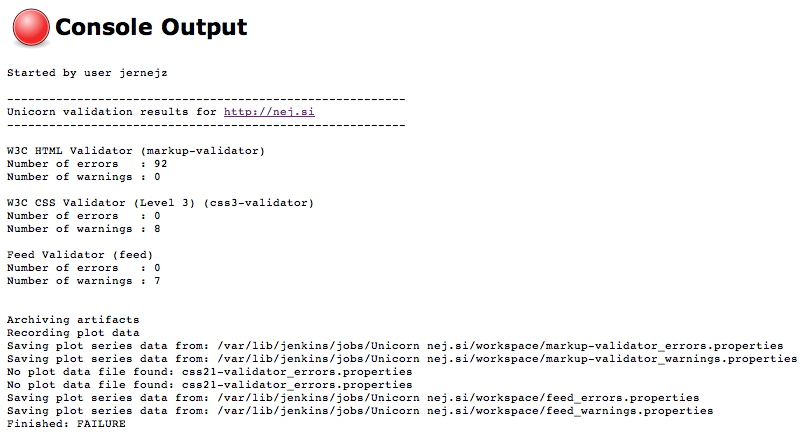
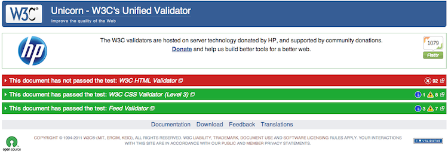
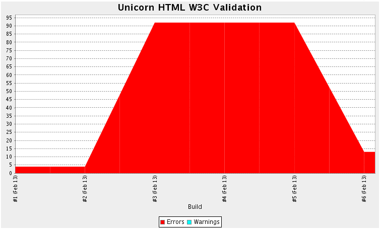

This plugin uses W3C's Unified Validator, which helps improve the
quality of Web pages by performing a variety of checks.

# **General**

The plugin uses gets number of errors/warnings from W3C's Unified
Validator. W3C Unicorn Service (<http://validator.w3.org/unicorn/>)
helps to improve the quality of Web pages by performing a variety of
checks (HTML validation, CSS validation,...). This plugins takes few
arguments (url to check, w3c validator url and threshold for number of
errors and warnings to decide the build result) ... look at the
Configuration section.

It outputs results to the console and to some properties files which can
then be later used with Plot Plugin to output some build history graphs
(see the template below for configuration).

##### **Example of results**

##### Example of the W3C Unicorn html output

##### 

##### **Example of a Plot**

# **Configuration**

### **Global Configuration**

None.

### **Project Configuration**

For a project to use the Unicorn Validation plugin, you need to add it
as a build step to your job:

  
Here you can specify:

Unicorn service URL - the w3c's url is the default one, but you can
specify your own if you have custom unicorn service

Site to validate - the url of the site to validate

Max number of errors/warnings for build to be stable/unstable - this is
your threshold to decide if the build should be stable/unstable/failed
... currently these number are the same for every aspect of unicorn
result (html, css, rss).

### **Plot Configuration**

You can also get a pretty graph which shows you number of
warnings/errors of previous builds. There a unicorn template for that to
help you configure it.

Plugins required:

-   [Plot plugin](http://wiki.hudson-ci.org/display/HUDSON/Plot+Plugin)

Steps to create a new job:

1.  Check out the [unicorn-template
    project](http://github.com/nej/unicorn-template) from
    Git: git@github.com:nej/unicorn-template.git
2.  Reload Jenkins' configuration
3.  Click on "New Job".
4.  Enter a "Job name".
5.  Select "Copy existing job" and enter "unicorn-template" into the
    "Copy from" field.
6.  Click "OK".
7.  Disable the "Disable Build" option.
8.  Setup your build trigger
9.  Fill in your "Site to validate" url
10. Click "Save".

# TODO

\- currently these number are the same for every aspect of unicorn
result (html, css, rss) ... ability so specify numbers for each result
specifically 

\- currently all the test are executed that the unicorn validator offers
... ability to choose which ones to execute

# **Version History**

#### **0.1.0 (Feb 13, 2011)**

-   Initial public release
