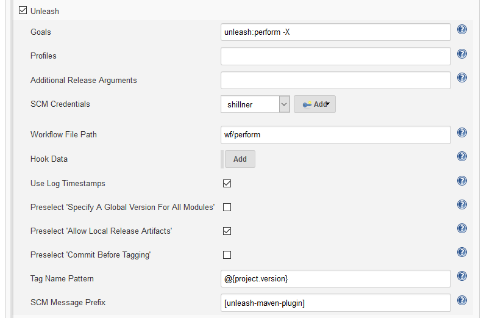
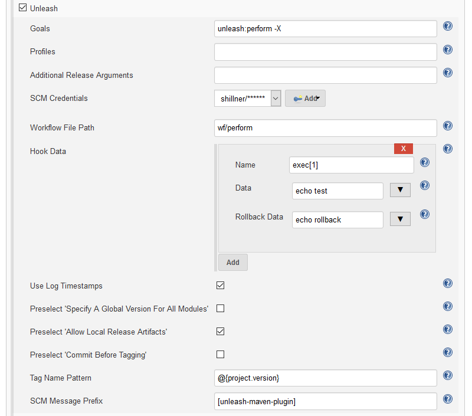
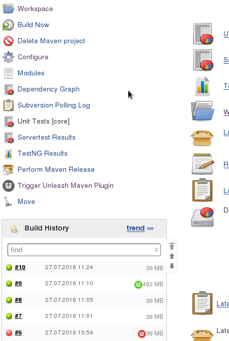
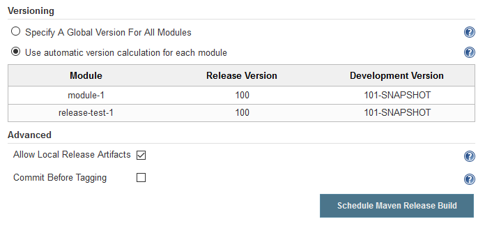
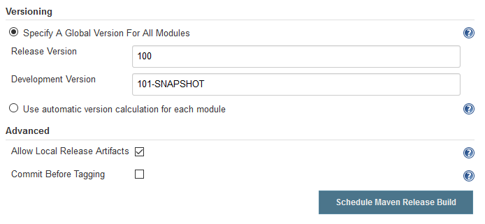
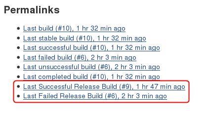

# Unleash plugin - **Deprecated**

This is a Jenkins Build Wrapper for Maven Jobs. It enables you to
perform Maven releases using the
[unleash-maven-plugin](https://github.com/shillner/unleash-maven-plugin).

# **DEPRECATED**

**This plugin is deprecated.**
The [Apache Maven unleash plugin](https://github.com/shillner/unleash-maven-plugin) is no longer being developed.
Users should move to other maven release processes, like the [Apache Maven release plugin](https://maven.apache.org/guides/mini/guide-releasing.html).

# How To Use The Plugin?

This section describes the project configuration options as well as the
actual usage of the plugin when building Maven releases.

### Project Configuration

In order to use the plugin for building Maven releases you will have to
enable it first in the configuration of your Maven build job. Go to the
**Build Environment** section and enable the build wrapper by checking
the **Unleash** box.  
Then you will see some input fields for basic settings. There you can
add the required profiles and options for your release build. The goals
are pre-defined because currently unleash:perform is the only goals that
makes sense there.  

Clicking the Advanced... button shows some additional settings for
workflow overriding, SCM-related settings and some checkboxes that
affect the actual release form that we use later.  

The Hook Data section can then be used for really advanced stuff. If you
f.i. extend the default workflow and add an exec-hook to the workflow,
you will be able to provide data for the hook execution at this point.  

### Use The Plugin

The usage of the plugin is pretty simple and is nothing more than
submitting a form on a subpage of the project.  
After you've enabled the plugin a link will be shown on the left side of
the screen called **Trigger Unleash Maven Plugin**:  

After clicking on this link you will be directed to the form page where
you can start the release build for your project.  

On this page you can either specify a global version for all modules of
the project (for release and dev) or you stick to the versions provided
by the plugin and listed in the table which allows idependent versioning
of modules.  
You can also provide custom SCM credentials and reqeuest some other
stuff.  

### Release Info

Once you have some successful or failed release builds you can also get
some project-related release information, such as the badge icons
indicating successful or failed releases.  

There are also two permalinks available, one for successful and one for
failed releases.  

Finally there are some ListView columns:  

# Support

Issues around this plugin are tracked in the Jenkins Issue Tracker. To
browse open issues please visit [this
page](https://issues.jenkins-ci.org/secure/IssueNavigator.jspa?mode=hide&reset=true&jqlQuery=project+%3D+JENKINS+AND+status+in+(Open,+%22In+Progress%22,+Reopened)+AND+component+%3D+unleash-plugin).
There you can also file new ones if necessary.

General information about the usage of the Maven plugin can be found
here:
[unleash-maven-plugin](https://github.com/shillner/unleash-maven-plugin).

# Copyright Information

Substantial parts of the plugin sources have been extracted from the M2
Release Plugin. It served as a base for getting started since the
feature set was very similar.  
Please find further copyright notes in the source code.

# Version History

### 1.0.0 (July 28, 2016)

The intial version of the plugin.

**Unleash Maven Plugin versions:**  
**Minimum required:** 1.0.0  
**Maximum supported:**

### 1.1.0 (August 25, 2016)

Added support for credentials managed by the credentials plugin. These
credentials are passed to the Maven plugin as environment variables.  
The plugin supports Username/Password credentials as well as SSH
credentials. In case of SSH credentials only the passphrase is used for
the SCM providers. The private key must be present in the .ssh
directory.

**Unleash Maven Plugin versions:**  
**Minimum required:** 2.1.0  
**Maximum supported:**

### 1.2.0 (August 29, 2016)

-   Fixed
    [JENKINS-37752](https://issues.jenkins-ci.org/browse/JENKINS-37752):
    Release profile appending is buggy
-   Implemented
    [JENKINS-37408](https://issues.jenkins-ci.org/browse/JENKINS-37408):
    Add checkboxes for -X and -e on the formular site

**Unleash Maven Plugin versions:**  
**Minimum required:** 2.1.0  
**Maximum supported:**

### 1.2.1 (August 29, 2016)

The release profilesof the configuration are now also used for the
unleash invocation since there was some confusion and some issues when
building reactor projects that enable modules depending on profiles (the
release build has built the modules which have been enabled by the
profiles but the unleash build did not install and deploy them since
these modules were not active during the unleash build).

**Unleash Maven Plugin versions:**  
**Minimum required:** 2.1.0  
**Maximum supported:**

### 2.0.0 (September 29, 2016)

There are no funktional or non-functional changes of the plugin sources.
The only reason this release has been published was that the licensing
of this plugin has been switched. The plugin is now published under MIT
license to better fit into the Jenkins ecosystem.

**Unleash Maven Plugin versions:**  
**Minimum required:** 2.1.0  
**Maximum supported:**

### 2.1.0 (November 02, 2016)

-   Implemented
    [JENKINS-36981](https://issues.jenkins-ci.org/browse/JENKINS-36981):
    keep release builds. The advanced section of the unleash project
    configuration now contains an input field for the number of
    successful release builds to lock in the history.

**Unleash Maven Plugin versions:**  
**Minimum required:** 2.1.0  
**Maximum supported:**

### 2.1.1 (November 15, 2016)

-   Implemented
    [JENKINS-39714](https://issues.jenkins-ci.org/browse/JENKINS-39714):
    No badge shown for unstable builds. A yellow badge icon is now shown
    for running release builds as well as unstable ones. The latest
    successful relase permalink and the appropriate list view column now
    also show unstable builds

**Unleash Maven Plugin versions:**  
**Minimum required:** 2.1.0  
**Maximum supported:**

### 2.2.0 (April 25, 2017)

-   Fixed
    [JENKINS-36983](https://issues.jenkins-ci.org/browse/JENKINS-36983):
    The version calculation for the badge icons as well as the list view
    columns and the release overview page has been changed thoroughly.
    It shouldn't happen again that the badges or the columns show
    unknown versions.
-   Added an additional input field for the development version upgrade
    strategy. For more information about that feature please see
    [Unleash Maven Plugin Wiki -
    VersionUpgradeStrategy](https://github.com/shillner/unleash-maven-plugin/wiki/unleash%3Aperform#versionupgradestrategy).

**Unleash Maven Plugin versions:**  
**Minimum required:** 2.1.0  
**Maximum supported:**

### 2.3.0 (May 11, 2017)

-   Fixed
    [JENKINS-44050](https://issues.jenkins-ci.org/browse/JENKINS-44050):
    Improved SSH-based authentication by passing the private key that
    was referenced as a credential to the maven plugin. The private key
    will not be visible in the logs but will be set as an environment
    variable during the build.

**Unleash Maven Plugin versions:**  
**Minimum required:** 2.6.0  
**Maximum supported:**

**  
**

**  
**
