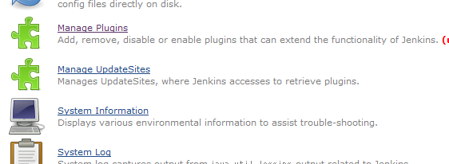
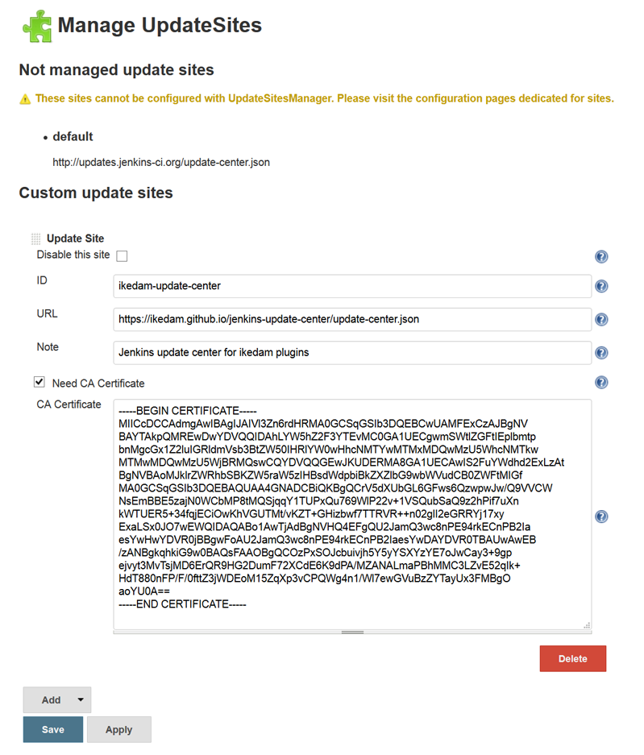

This plugin is to manage update sites, where Jenkins accesses in order
to retrieve plugins.

## What's this?

Sites where Jenkins finds and downloads new plugins, which are called
update sites, are listed in hudson.model.UpdateCenter.xml.  
This plugin enables you to manage update sites in the Jenkins
configuration page with web browsers.  
Following features are available:

-   "Manage UpdateSites" link is added to "Manage Jenkins" page.
-   You can list, add, edit, or delete an update site registered with
    Jenkins.
-   When adding a new update site, you specify following fields:
    -   Disable this site
        -   Check if you want to disable the update site temporary.
    -   ID
        -   The ID of the update site. Value to specify here is
            specified by the update site.
    -   URL
        -   The URL of the update site. Usually, the URL to
            update-center.json.
    -   Note
        -   A note. It is not used by Jenkins, and you can note anything
            here.
    -   CA Certificate
        -   CA Certificate for this site. This is useful for a update
            site which is signed with a self-signed certificate.

## Screenshots

-   "Manage UpdateSites" is added in "Manage Jenkins" page.  
    
-   You can list, add, edit, or delete an update site registered with
    Jenkins.  
    
    -   You can easily register an update site using a self-signed
        certificate by specifying CA cetificate for that site.

## Limitations

-   Following update sites are listed in "Manage UpdateSites" page, but
    cannot be edited nor deleted.
    -   Default update site (its ID is "default"). This can be
        configured in "Manage Plugins" page.
    -   Update sites provided by other plugins. These plugins must
        provide their own configuration pages for their update sites.

## TODO

-   Create a menu icon.

## How do I create a update center?

SEE :

-   <https://github.com/ikedam/backend-update-center2/wiki>
-   <https://github.com/jenkinsci/backend-update-center2>
-   [Juseppe](https://github.com/yandex-qatools/juseppe)

## Issues

To report a bug or request an enhancement to this plugin please create a
ticket in JIRA (you need to login or to sign up for an account). Also
have a look on [How to report an
issue](https://wiki.jenkins.io/display/JENKINS/How+to+report+an+issue)

-   [Bug
    report](https://issues.jenkins-ci.org/secure/CreateIssueDetails!init.jspa?pid=10172&issuetype=1&components=17576&priority=4&assignee=ikedam)
-   [Request or propose an improvement of existing
    feature](https://issues.jenkins-ci.org/secure/CreateIssueDetails!init.jspa?pid=10172&issuetype=4&components=17576&priority=4)
-   [Request or propose a new
    feature](https://issues.jenkins-ci.org/secure/CreateIssueDetails!init.jspa?pid=10172&issuetype=2&components=17576&priority=4)

Key

T

P

Summary

Loading...

Refresh

## Change Log

### Version 2.0.0 (Feb 28, 2016)

-   **Now targets Jenkins \>= 1.609**
-   Supports server-based download
    ([JENKINS-32376](https://issues.jenkins-ci.org/browse/JENKINS-32376))
    -   server-based download was introduced in Jenkins 1.557 and
        enabled by default in Jenkins 1.600.
-   Changed the design of the configuration page (See the above
    screenshot)
    -   You can list and edit update sites in the same page.
-   Refactored the code and doesn't preserve binary compatibilities with
    versions \< 2.0.0.
    -   Preserves configuration compatibilities and doesn't affect users
        in almost all cases.
    -   Plugins depending on update-sites-manager might not work when
        you upgrade from versions \< 2.0.0.
    -   No official plugins provided by Jenkins communities doesn't
        depend on update-sites-manager for now.
    -   Private plugins (e.g. plugins developed internally in your
        company) might be broken.
        -   Please let me know if features you need for those plugins is
            no longer available.

### Version 1.0.1 (Jul 28, 2013)

-   Added help texts.

### Version 1.0.0 (Apr 09, 2013)

-   Initial release.
