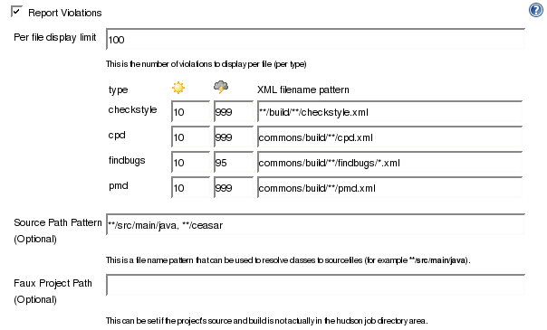
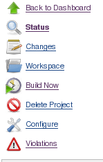
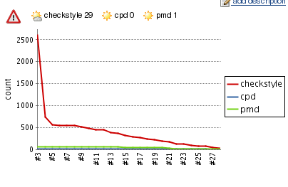
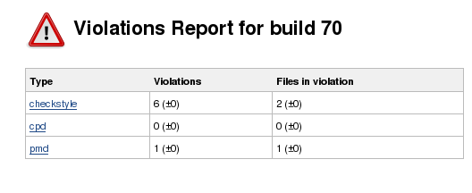
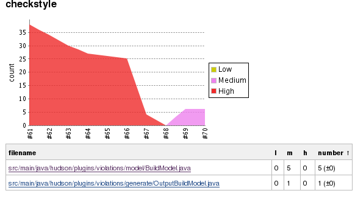
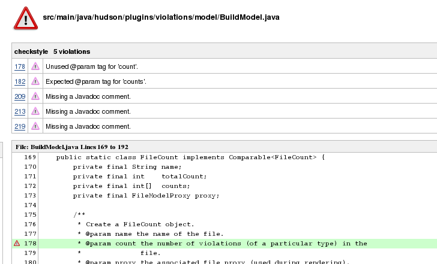

  
This plug-in generates reports static code violation detectors such as
checkstyle, pmd, cpd, findbugs, codenarc, fxcop, stylecop and simian.  
  
  
**This plugin is no longer maintained, you may want to use the Warnings
Plugin:**
**<https://wiki.jenkins-ci.org/display/JENKINS/Warnings+Plugin>**  
  

**Note: Since version 0.6.0 the violations plugin works with the jenkins
maven2 project type..**  
  

# Description

The violations plug-in scans for violation xml files of particular types
in the build workspace, gathers the violations and reports on the
numbers for each type. The currently supported types are:

[TABLE]

# Configuration

**Note: the following snapshots are from version 0.4, version 0.7 is
similar (with pylint, fxcop, stylecop, simian and gendarme added).**

Configuration should be easy, First you need to have activate the static
code analysizers in your build. Then activate the Violations plugin as
shown below.   
   
 

The fields are:

| name                   | description                                                                                                                                                                                                                                                                                                                                                                    |
|------------------------|--------------------------------------------------------------------------------------------------------------------------------------------------------------------------------------------------------------------------------------------------------------------------------------------------------------------------------------------------------------------------------|
| Per file display limit | This is used to limit the number of violations displayed per file per violation type.                                                                                                                                                                                                                                                                                          |
| type                   | The violation type.                                                                                                                                                                                                                                                                                                                                                            |
| sun icon               | This is the lowest number of violations of this type to generate the sunny weather report. For example the value 10 means that violations 0 to 10 will cause a sunny report, 11 and higher will be cloudy or worse.                                                                                                                                                            |
| stormy icon            | The is the lowest number of violations of this type to generate the stormy weather report.                                                                                                                                                                                                                                                                                     |
| XML filename pattern   | This is an ant type pattern to match violation files of this type in the workspace. Multiple patterns may be separated by commas.                                                                                                                                                                                                                                              |
| Source Path Pattern    | This is an optional field. It is used to resolve classnames to source file names. It is only currently used by the findbugs violations type.                                                                                                                                                                                                                                   |
| Faux Project Path      | This is an optional field. It is used if you just want to run jenkins as a reporting engine for a project not in jenkins workspace. For example, the violations plugin has a jenkins job that cd's to the cvs directory, creates the checkstyle, pmd and cpd reports and the invokes violations plugin with the faux project path set to (PATH TO CVS DIR)/plugins/violations. |

After configuration, the Violations plugin will collect violations from
the next build. The following pages are created or modified.

# Project Page

The project page is modified to add a violation icon (
)
and a violation trend graph:

Clicking on the violations link brings one to the current violations
report. 

# Build page

  

The build page also has the violations trend and the violations icon.
Clinking on the violations link brings one to the violations report for
this particular build.

#  Violations report page

**Note the following snapshots are from 0.4, 0.7 is similar, except that
the +/- notation has been removed.**

The start of the violations report page looks like this:  
  
For each violation type a trend and file summary is shown as follows:
  
The order of the table can be changed by clinking on the column header.

#  Per File Report

Linking on the file link brings on to the file report. This will show
all the violations (up to a limit specified in the config page) of a
file, Each violation has a line number, an icon representing the
severity and a description of the violation. Hovering over the icon will
give more detail on the violation - and for **findbugs,** this will be
the long detailed message. After the list of violations, snipets from
the source file will be shown for each violation. This will only happen
if the violations plugin can find the file in question.  
  
   
.  
 Hovering over the violations icon on the highlighted line will cause a
pop-up of the violations on the line:

# Version History

Version 0.7.11:

-   Added perlcritic support.
-   Fixed XSS scripting vulnerabilities

Version 0.7.10:

-   Added cpplint support.

Version 0.7.9:

-   Fixed paths with native multi m2
    projects: <https://issues.jenkins-ci.org/browse/JENKINS-1850>

Version 0.7.8:

-   Moved over to jenkins and git

Version 0.7.7: upcoming

-   Fixed an absolute path handling in the violations report
    ([JENKINS-3529](https://issues.jenkins-ci.org/browse/JENKINS-3529))

Version 0.7.6: Aug 01, 2010

-   Add JSLint support
-   Add JcReport support

Version 0.7.5: Dec 29, 2009

-   Add Gendarme support
-   Update uses of deprecated APIs

Version 0.7.3: Feb 11, 2009

-   Bugfix: fix npe in m2 reporting -
    [JENKINS-2174](https://issues.jenkins-ci.org/browse/JENKINS-2174)

Version 0.7.1: August 25, 2008

-   Bugfix: updated support for stylecop v4.3
    [JENKINS-2242](https://issues.jenkins-ci.org/browse/JENKINS-2242)

Version 0.7.0: May 28, 2008

-   Enhancement: add support for stylecop

Version 0.6.0: May 5, 2008

-   Enhancement: add support for M2 job type
-   Enhancement: support for setting the build to unstable if the number
    of violations  
    of a certain type exceed a threshold.

Version 0.5.8 April 22, 2008

-   Enhancement: add simian violations

Version 0.5.7 April 16, 2008

-   Bugfix(1550): fix for invalid decoding of some cpd.xml files
-   Bugfix(1558): fix for missing dependence on xpp3

Version 0.5.6 April 8, 2008

-   Bugfix(1129): fix for .. in paths in checkstyle reports

Version 0.5.5 March 30, 2008

-   Bugfix(1281) pmd priorities were incorrect
-   Bugfix(1217) reading of xml files used incorect character encoding
-   Feature(1217) allow user to specify encoding of source files
-   Feature readin in fb-contrib findbugs descriptions

&nbsp;

-   Bugfix: fix of  
    Version 0.5.4 Feb 25 2008
-   Bugfix: Fix so pylint errors are marked as errors.

Version 0.5.3 Oct 22 2007

-   Bugfix: Fix for cpd on dos

Version 0.5.2 Oct 10 2007

-   Bugfix: Fix a bug where the filename is an absolute dos type name
    (Brian Dueck)

Version 0.5.1 Sep 28 2007

-   Bugfix: remove use of a jdk6 constructor

Version 0.5 Sep 24 2007

-   Bugfix: fix serialization with slaves
-   Enhancement: add fxcop and pylint violations (Erik Ramfelt)
-   Enhancement: allow non xml report files
-   Enhancement:: change +/- to use colors

Version 0.4 Aug 15 2007

-   Bugfix: fix handling of findbugs for files without debug info
    [JENKINS-722](https://issues.jenkins-ci.org/browse/JENKINS-722)
-   Enhancement: show severity levels
-   Enhancement: provide trend graph for severity levels on the report
    page
-   Enhancement: add detail hover for findbugs on the file page
-   Enhancement: add  +- changes on the report and build pages.
-   Enhancement: make the file list table sortable.

Version 0.3 Aug 10 2007

-   Bugfixe: fix  NPEs when reading  findbugs violation files
-   Bugfix: in getting the sourcelines from findbugs violation files
-   Enhancement: allow user to optionally specify a source path pattern
    to resolve classes (used by the findbugs parser)
-   Enhancement:: allow user to optionally specify a different project
    path for resolving file names.

Version 0.2 Aug 08 2007

-   Bug fix for maven findbugs plugin

Version 0.1 Aug 08 2007

-   Initial release
