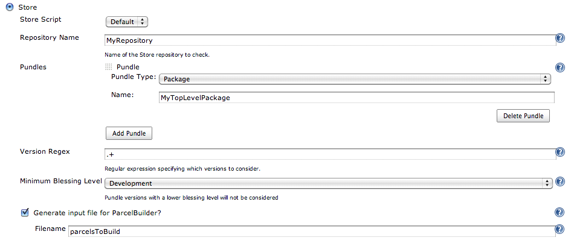

This plugin integrates Jenkins with [Cincom
Visualworks](http://cincomsmalltalk.com/) Smalltalk Store.  The plugin
requires at least one shell script or batch file to be created that can
run a Visualworks image with the StoreCI-Polling package loaded.

# Using the Visualworks Store Plugin

In order to use the Visualworks Store Plugin, a few steps are required.

## Configure a Visualworks Image

This plugin requires the StoreCI-Polling package that is available in
the [Cincom Public Store
Repository](http://www.cincomsmalltalk.com/CincomSmalltalkWiki/Public+Store+Repository).
 StoreCI-Polling works with Cincom Visualworks 7.7 or later.

StoreCI-Polling is part of the [StoreCI
suite](https://github.com/randycoulman/StoreCI).

To use this plugin, build a Visualworks image that contains the
following:

-   The Store package for your Store repository database (e.g.
    StoreForPostgreSQL).
-   Repository definitions for each of the Store repositories you want
    to use with the plugin (or use the -importRepositories command-line
    option).
-   The StoreCI-Polling package (or a Parcel version of that package
    available).

## Create a Shell Script or Batch File to Run Your Image

This plugin expects to run a shell script or batch file that runs
Visualworks with the image you created above.  This script should pass
all of its arguments on to the image.  For example, a Linux or MacOS/X
script might contain a line such as:

``` syntaxhighlighter-pre
 /path/to/visualworksVM /path/to/image "$@"
```

Or, if you saved StoreCI-Polling as a parcel instead:

``` syntaxhighlighter-pre
 /path/to/visualworksVM /path/to/image -pcl /path/to/StoreCI-Polling.pcl "$@"
```

This plugin allows more than one such script to be configured.  This
allows different builds to be run using different versions of
Visualworks.

## Install the Plugin

Install the plugin either using Jenkins plugin administration or
manually.

## Configure the Plugin

If the plugin was installed correctly, there will be a Visualworks Store
section in the global configuration page of Jenkins (Manage Jenkins \|
Configure System).  Enter the path to the shell script or batch file you
created above.  If you created more than one script, use the Add Script
button to configure any additional scripts.


## Configure a Build to Use Visualworks Store

In the Source Code Management section of your build, choose Store.
  
Specify the following settings:

-   **Store Script:** Choose one of the scripts you configured in the
    global settings.
-   **Repository Name:** Specify the name of the Store repository to
    monitor.
-   **Pundles:** Choose the type (Package or Bundle) and enter the name
    of a pundle to monitor.  If you would like to specify more than one
    pundle, use the Add Pundle button.  StoreCI-Polling will watch for
    changes to those pundles and any of their (recursive) prerequisites
    in the same repository.  Thus, it is only necessary to specify
    "root" pundles here.
-   **Version Regex:** Specify a regular expression that indicates which
    pundle versions you would like to consider.  By default, all
    versions are considered.  The regular expression must be in Regex11
    format.  For example, integer-only version numbers can be matched
    using "\\d+".
-   **Minimum Blessing Level:** Specify a minimum blessing level
    (default: Development).  Pundles with a lower blessing level will
    not be considered.
-   **Generate input file for ParcelBuilder?:** If desired, check the
    box to enable generation of an input file for ParcelBuilder (now
    called StoreCI-Building) and then specify a filename.  This file
    will contain the list of most-recent pundle versions that were found
    by StoreCI-Polling as of the time the build started.  This file can
    be used by StoreCI-Building (available in the Public Store
    Repository) or a similar tool to build an image or deploy parcels as
    part of the build.  If no path is specified, the file will be
    created in the root of the Jenkins workspace directory for your
    project.  This file will contain the pundles in "load order".  That
    is, all of a pundle's prerequisites will be earlier in the list than
    the pundle itself.  That way, when loading the pundles into an
    image, no automatic prerequisite resolution will need to be done.

Visualworks Smalltalk Store Plugin is designed to work with the
[Multiple SCMs
Plugin](http://localhost:8085/display/JENKINS/Multiple+SCMs+Plugin).
 This is useful if you need to monitor more than one repository for the
same build, or if you need to monitor both a Store repository and a git
or Subversion repository.

# Changelog

### Version 1.1.1

[\[JENKINS-23389\]](https://issues.jenkins-ci.org/browse/JENKINS-23389) Support
checking out on a build slave.

### Version 1.1

Failed release; skipping

### Version 1.0

Initial version.
