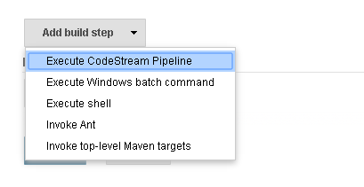
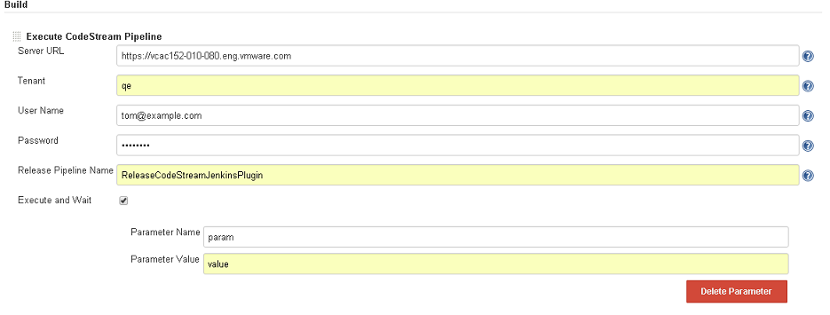

Provide integration with [vRealize Code
Stream](https://www.vmware.com/products/vrealize-code-stream)

# Job Configuration

**    1. Build step** : On Job configuration page click on **Add build
step **select “Execute CodeStream Pipeline” option                     
       

                        
  
**    2. Configure**** : ** Configure CodeStream pipeline like show in
image. Below is the description of each field**                         
                                                                       
                                     **

-   -   Server URl -   vRealize CodeStream host URL
    -   Tenant - User group tenant against which you want to execute the
        pipeline
    -   User Name - Username for given tenant. User should have Release
        Manager or Release Engineer Role.
    -   Password - Password for given user
    -   Release Pipeline Name - Pipeline which you want to execute.
        Pipeline should be activate and its latest version will be
        executed.
    -   Execute and Wait - If this checkbox is checked the job will wait
        for pipeline execution to complete or fail.
    -   Add Parameter - If you want to override default value of any
        pipeline property then you can use this option. Click on Add
        Parameter and provide property name in Parameter Name. New
         value in Parameter Value. For all the other properties default
        value will be used.

                     

# Output

Plugin publish below o/p Jenkins parameters once the execution is
complete.

-   CS\_PIPELINE\_EXECUTION\_ID - Pipeline execution id
-   CS\_PIPELINE\_EXECUTION\_STATUS - Pipeline execution status. This
    parameter is available only if "Execute and wait" checkbox is
    checked.
-   CS\_PIPELINE\_EXECUTION\_RES - Pipeline execution object as JSON.
    This parameter is available only if "Execute and wait" checkbox is
    checked.
