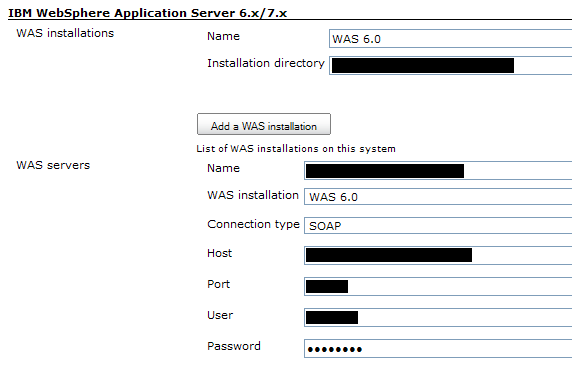
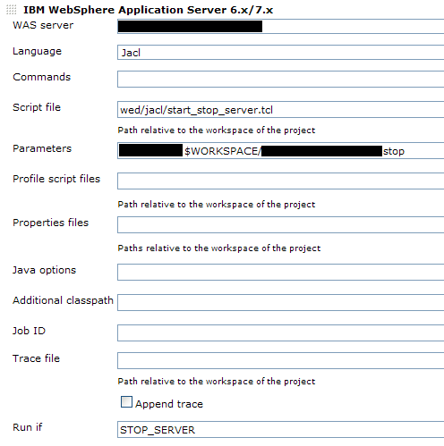

This plugin allows Jenkins to invoke IBM WebSphere Application Server's
**wsadmin** as a build step.

# About this plugin

This plugin allows to invoke the **wsadmin** command of IBM WebSphere
Application Server (WAS) 6.0/6.1/7.0 as a build step. It can be used for
example to deploy a freshly built application (self-promo: using the
[RAD Builder
Plugin](https://wiki.jenkins.io/display/JENKINS/RAD+Builder+Plugin)).

This plugin supports:

-   WAS 6.0 (versions 1.0 to 1.6 successfully tested with WAS 6.0.2.15 –
    should work with other 6.0.2.x versions)
-   WAS 6.1 (not yet tested)
-   WAS 7.0 (version 1.1 to 1.6 successfully tested with Administration
    Thin Client built from WAS 7.0.0.7 – should work with other 7.0.0.x
    versions)
-   WAS 8.0 (version 1.6 successfully tested with full WebSphere v8
    non-ND installation – thanks Ilko Iliev for the feedback)

# User guide

Before adding a WAS build step to a job, the WAS Builder plugin must be
configured as follow:

-   First, one or several WAS installations must be defined in Jenkins'
    main configuration panel (cf. upper part of the screenshot below).
    These WAS installations must not necessarily correspond to some
    running WAS servers: The plugin simply uses their wsadmin command
    (the one located in the `bin` folder of the installed product) to
    connect to remote servers.  
    
-   Once at least one installation is defined, you need to save the
    changes and to go back to Jenkins' main configuration panel to be
    able to define the servers that the jobs will use (lower part of the
    screenshot above).

Once at least one server is defined, it's possible to add some "IBM
WebSphere Application Server 6.x/7.x" build steps to your jobs (cf.
screenshot below). Most of **wsadmin** options can be controlled through
the GUI. Take a look at the inline help (the little question marks
located on the right of each field) to know more about each feature.  

The **Run if** field doesn't correspond to a **wsadmin** option. It can
be used to dynamically enable/disable a build step for a particular run:
If **Run if** is defined (let's say with the `STOP_SERVER` value) for a
build step, then the build step will be run if and only if:

-   a build variable with the same name (in our case, `STOP_SERVER`) is
    defined and has a value,
-   or (exclusive) if no build variable with the same name is defined
    and an environment variable with the same name (still `STOP_SERVER`
    in our example) is defined, whether it has a value or nor.

When defining a build step for WAS 6.0, be sure to refer to the inline
help to know if you can use it: Some options (job ID, trace file, etc.)
are available only for WAS 6.1 or greater.

Check-out [this
post](https://www.ibm.com/developerworks/mydeveloperworks/groups/service/forum/topicThread?topicUuid=56eb2ce6-5a76-48b2-ae96-9ee730c3548b)
on IBM developerWorks to get an introduction on how this plugin can be
used (thanks Ilko).

# Version history

### Version 1.6.1 (10/20/2011)

-   Fixed
    [JENKINS-11104](https://issues.jenkins-ci.org/browse/JENKINS-11104):
    `wsadmin` was not working when used with `sudo`

### Version 1.6 (08/07/2011)

-   Update for Jenkins

### Version 1.5 (04/23/2010)

-   Added a new **Wsadmin command** field (at the WAS installation
    level) allowing to tweak the `wsadmin.bat`/`wsadmin.sh` command
    actually run, for example to prefix it with `sudo`.
-   The list of WAS servers is now alphabetically sorted when saving the
    global configuration.

### Version 1.4 (04/13/2010)

-   The **Run if** option now allows to use boolean parameters in
    addition to build or environment variables.

### Version 1.3 (04/13/2010)

-   Added an option which allows creating automatically, if the
    [locks-and-latches
    plugin](https://wiki.jenkins.io/display/JENKINS/Locks+and+Latches+plugin)
    is installed, one lock per defined WAS server.

### Version 1.2 (04/06/2010)

-   Added an option for allowing the **wsadmin** user/password at the
    build step level.

### Version 1.1 (03/30/2010)

-   Added the support for [administration thin
    clients](http://publib.boulder.ibm.com/infocenter/wasinfo/v7r0/topic/com.ibm.websphere.nd.multiplatform.doc/info/ae/ae/txml_adminclient.html).

### Version 1.0.1 (01/24/2010)

-   Bug fix: Installations defined for slave nodes were not taken into
    account; The plugin was always referring to the installation on the
    master node.

### Version 1.0 (12/18/2009)

-   Initial release
