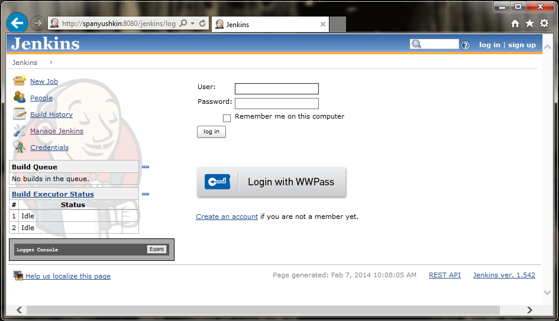

# WWPass Authentication Plugin for Jenkins CI

------------------------------------------------------------------------

Plugin for Jenkins CI implements authentication via WWPass Keyset. This
plugin may used as primary security realm or as federated login service.

### Plugin setup

First, you need to register at <https://developers.wwpass.com/> and get
a Service Provider's personal certificate and key pair.

Plugin searches the certificate-key pair on the following paths by
default:

|                  |                          |                               |
|------------------|--------------------------|-------------------------------|
|                  | Windows                  | Linux                         |
| Certificate file | C:/wwpass/wwpass\_sp.crt | /etc/ssl/certs/wwpass\_sp.crt |
| Key file         | C:/wwpass/wwpass\_sp.key | /etc/ssl/certs/wwpass\_sp.key |

You may use this paths and names. If you want to use other paths and
names for these files, change it in Jenkins settings:

-   if you use WWPass authentication as a secondary realm, change these
    properties in \***Manage Jenkins\>Configure System**\*:

-   or if you use it as a primary realm - in \***Manage
    Jenkins\>Configure Global Security**\*):

After that, you'll get "Login with WWPass" on the login screen.

Federated login service:

Primary security realm:

If you will use WWPass Authentication Plugin as a federated login
service, every user may bind/unbind WWPass Key to his account by
pressing the bind/unbind button on the User\_name\>Configure screen:

